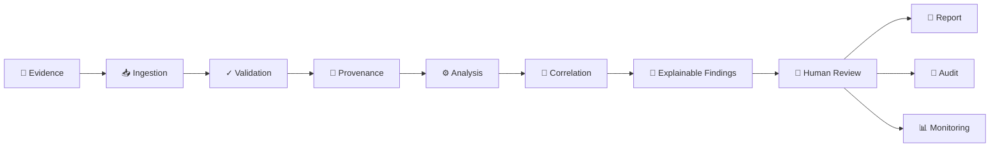
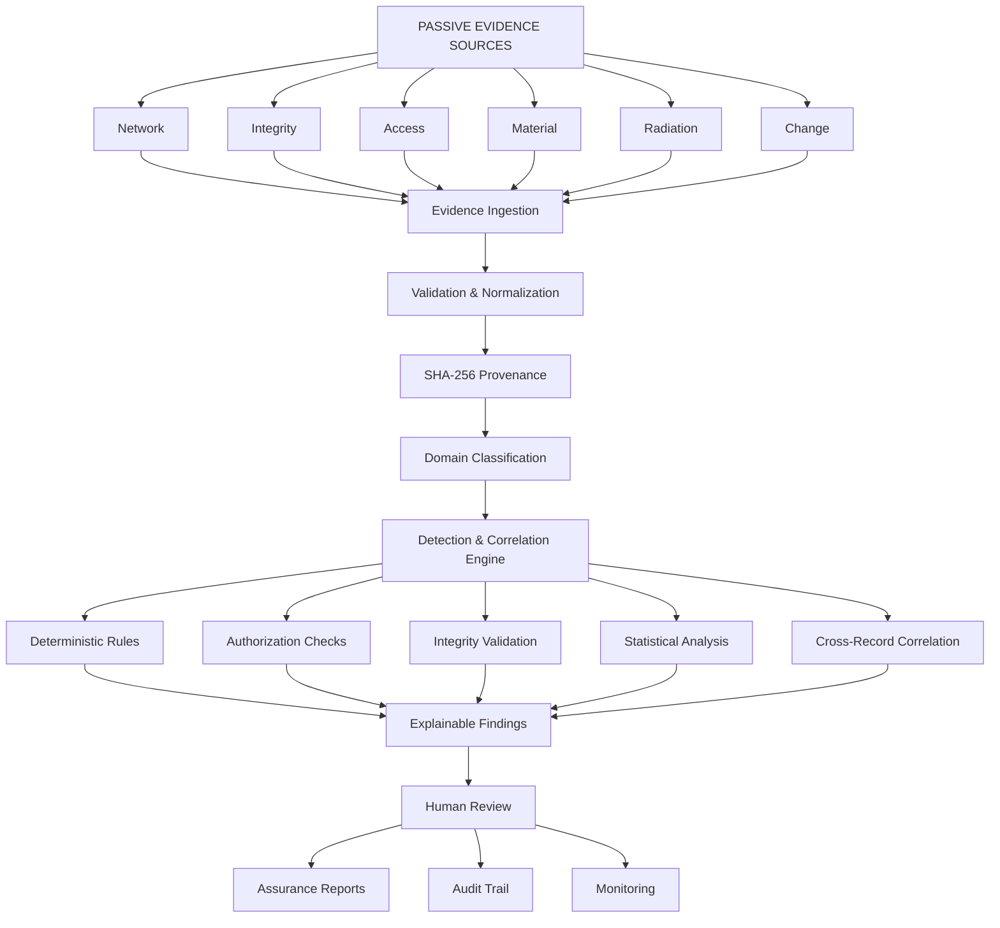
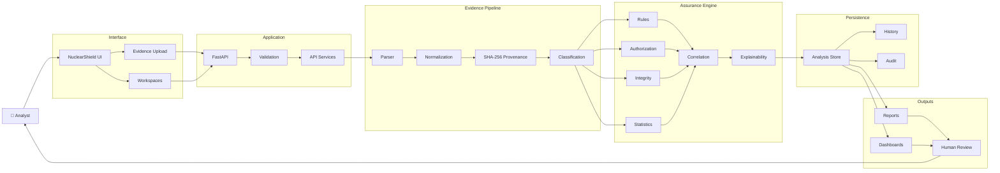
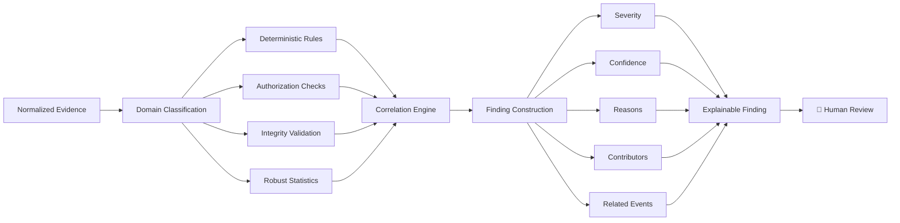
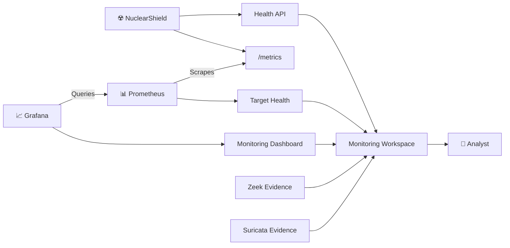
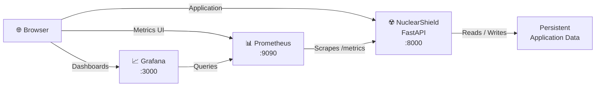
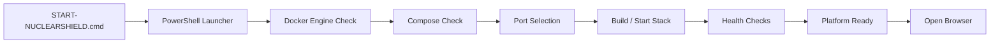
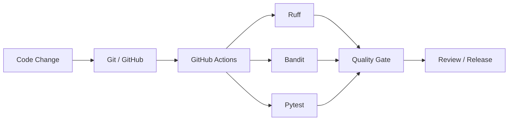

<div align="center">


# ☢️ NuclearShield

### Advanced Nuclear Cybersecurity Assurance Platform

**Defensive · Read-Only · Evidence-Driven · Explainable · Auditable**

**Version 1.0.8**

NuclearShield is a defensive cybersecurity assurance workstation that transforms passive security evidence into explainable findings, correlations, monitoring intelligence, reports, and auditable human decisions — without sending commands to operational technology.

<br>


</div>

---

## 🛡️ Safety Authority

> **NuclearShield is a defensive, read-only educational demonstrator.**
>
> Every included record is fictional and synthetic.
>
> NuclearShield has **no plant-control capability** and must never be connected to a real nuclear facility, SCADA/I&C network, safety system, physical-access system, nuclear material-accounting system, or production operational environment.

### READ-ONLY BOUNDARY

**Observe → Verify → Analyze → Explain → Report**

**Human authority remains the final decision boundary.**

---

# 🚀 Quick Start

## Requirements

Before running NuclearShield, install:

- Git
- Docker Desktop
- Docker Compose v2
- Windows 10/11
- Modern web browser

Clone the repository:

```powershell
git clone https://github.com/ruveeha33/NuclearShield.git
cd NuclearShield
```

### Windows — Recommended

Double-click:

```text
START-NUCLEARSHIELD.cmd
```

Or run:

```powershell
powershell -ExecutionPolicy Bypass -File .\start-nuclearshield.ps1
```

The launcher automatically:

- checks Docker;
- starts Docker Desktop when available but not ready;
- validates Docker Compose;
- detects port conflicts;
- selects available alternative ports when necessary;
- builds the NuclearShield application;
- starts Prometheus and Grafana;
- waits for application health;
- displays the active URLs; and
- opens NuclearShield in the browser.

No unrelated process is terminated just to reclaim a preferred port.

---

# 🔄 NuclearShield Workflow

NuclearShield follows an **evidence-to-decision** model.



### Evidence → Analysis → Explanation → Human Decision

NuclearShield does not turn a detection directly into an operational action.

Instead, it preserves the separation between **machine-assisted analysis** and **human authority**.

---

# 🧠 How NuclearShield Works

NuclearShield processes passive evidence through a controlled assurance pipeline.



The analytical engine produces **reviewable evidence**, not autonomous operational actions.

---

# 🎯 What NuclearShield Does

NuclearShield turns passive defensive evidence into a structured assurance workflow.

It is designed to answer:

> **What happened?**

> **Which evidence supports it?**

> **Why was it detected?**

> **How confident is the analysis?**

> **What events are related?**

> **What should be reviewed next?**

> **Who retains decision authority?**

The platform focuses on **defensible evidence**, not autonomous operational response.

---

# 🏗️ Platform Architecture

NuclearShield uses a layered architecture separating the interface, application services, evidence pipeline, assurance engine, persistence, outputs, and observability.



### Architecture Layers

| Layer | Responsibility |
|---|---|
| **Interface** | Evidence upload, dashboards and analyst workspaces |
| **Application** | FastAPI routes, validation and request handling |
| **Evidence Pipeline** | Parsing, normalization, provenance and classification |
| **Assurance Engine** | Rules, authorization, integrity, statistics and correlation |
| **Explainability** | Converts analytical results into reviewable findings |
| **Persistence** | Analysis history and audit information |
| **Outputs** | Reports, dashboards and human review |

> NuclearShield stops at **decision support**. Findings are presented to the analyst rather than converted into operational control actions.

---

# 📥 Evidence Ingestion

NuclearShield accepts passive defensive evidence in:

| Format | Support |
|---|---|
| CSV | ✅ |
| JSON | ✅ |
| JSONL | ✅ |
| NDJSON | ✅ |
| Zeek ASCII `.log` | ✅ |

Zeek `.log` evidence requires a `#fields` header.

The ingestion layer performs:

```text
Upload
   ↓
File Validation
   ↓
Schema Adaptation
   ↓
Normalization
   ↓
Record Validation
   ↓
SHA-256 Provenance
   ↓
Domain Classification
   ↓
Analysis
```

### Demonstration Limits

```text
Maximum file size : 10 MB
Maximum records   : 50,000
```

Uploaded evidence is treated as untrusted input.

---

# 🧩 Flexible Evidence Schema

NuclearShield recognizes common field alternatives rather than requiring every source to use exactly the same schema.

For the strongest analysis, evidence can include:

```text
event_id
timestamp
event_type
source
value
baseline
authorized
integrity
actor
asset
```

Supported evidence domains include:

```text
network
integrity
access
material
radiation
change
```

A finding represents an analytical result — not proof that a real-world nuclear or industrial event occurred.

---

# 🔎 Detection & Correlation Architecture

NuclearShield combines transparent deterministic checks, integrity and authorization analysis, statistical analysis, and correlation.



A finding can therefore preserve both the analytical result and the evidence explaining how that result was reached.

### Deterministic Rules

Known evidence conditions are evaluated through transparent logic.

### Authorization Checks

Evidence can be evaluated for declared authorization state.

### Integrity Validation

Integrity-oriented records can be checked for declared mismatches or validation failures.

### Robust Statistical Analysis

Where sufficient peer-group numeric evidence exists, NuclearShield can use robust anomaly analysis.

Statistical analysis is used as **decision-support evidence**, not proof of malicious activity.

### Correlation

Related records can be associated through shared evidence characteristics such as actors, assets, and event relationships.

### Explainable Findings

A finding can expose:

```text
Event ID
Severity
Confidence
Detection Engine
Reasons
Contributors
Related Events
Human Authorization Requirement
```

**Detection does not equal autonomous action.**

The output remains decision-support information for human review.

---

# 🌐 Zeek & Suricata Evidence

NuclearShield includes passive network-security evidence support inspired by common Zeek and Suricata evidence formats.

### Zeek-Style Evidence

```text
sample-data/06-zeek-conn-synthetic.log
```

### Suricata-Style Evidence

```text
sample-data/07-suricata-eve-synthetic.jsonl
```

The Monitoring workspace presents evidence-driven sensor consoles.

These consoles do **not** claim to represent live nuclear-facility telemetry.

They display uploaded or synthetic defensive evidence only.

---

# 🖥️ NuclearShield Workspaces

## 📊 Overview

Provides the high-level assurance picture:

- analyzed evidence;
- finding counts;
- severity information;
- evidence-domain information;
- recent analyses; and
- platform status.

---

## 📥 Ingestion

The entry point for evidence analysis.

Users can:

- upload supported evidence;
- inspect ingestion results;
- use the built-in synthetic demonstration; and
- create a persistent analysis record.

---

## ⚙️ SCADA

Provides a defensive view of industrial-control-oriented evidence.

The workspace is **passive and read-only**.

It does not:

- write PLC logic;
- issue SCADA commands;
- modify set points;
- manipulate field devices; or
- control physical processes.

---

## 🔐 Integrity

Surfaces integrity-oriented evidence and associated detection results.

The purpose is to support review of declared integrity state rather than automatically change system configuration.

---

## ☢️ Material

Provides synthetic safeguards-oriented evidence views for educational analysis.

No real nuclear-material records are included.

---

## 🧠 AI Detection

Displays explainable findings and their analytical context.

The emphasis is:

**why the finding exists**, not simply that an alert was generated.

---

## 🛠️ DevSecOps

Represents software-assurance and quality-gate information associated with the NuclearShield development lifecycle.

The repository includes:

- automated tests;
- linting;
- static security analysis; and
- GitHub Actions CI.

---

## 📋 Compliance

Provides evidence-oriented framework mappings.

These mappings help demonstrate how collected evidence may be organized against assurance themes.

They are **not certification or compliance attestation**.

---

## 📄 Reports

Transforms analysis results into a structured assurance report.

Reports include:

- analysis context;
- findings;
- severity;
- confidence;
- evidence;
- detection method;
- related evidence;
- recommended measures;
- decision authority;
- evidence mapping; and
- audit-oriented context.

Reports can be:

- viewed in-browser;
- printed; or
- downloaded as HTML.

The downloaded report embeds NuclearShield branding for offline viewing.

---

## 📡 Monitoring

Provides platform and passive security-monitoring visibility through:

- Prometheus
- Grafana
- NuclearShield metrics
- Zeek-style evidence
- Suricata-style evidence
- platform health information

---

## 📜 Audit

Maintains traceable platform activity.

The audit system is designed so that deleting an analyzed-file record does not silently erase the associated audit history.

---

# 📊 Monitoring Architecture

NuclearShield separates **application observability** from **passive cybersecurity evidence**.



### Two Different Monitoring Roles

| Area | Purpose |
|---|---|
| **Prometheus / Grafana** | Application observability, metrics and service health |
| **Zeek / Suricata Evidence** | Passive cybersecurity evidence analysis |

Neither represents fabricated live nuclear-process telemetry.

If Prometheus or Grafana is unavailable, NuclearShield reports the service as unavailable rather than displaying a false healthy state.

---

# 🌐 Default Services

When the preferred ports are available:

| Service | URL |
|---|---|
| ☢️ NuclearShield | `http://localhost:8000` |
| 📄 Assurance Report | `http://localhost:8000/api/report` |
| 📊 Prometheus | `http://localhost:9090` |
| 🎯 Prometheus Targets | `http://localhost:9090/targets` |
| 📈 Grafana | `http://localhost:3000` |

If a preferred port is unavailable, the launcher selects another available port.

Selected ports are recorded in:

```text
.runtime-ports.env
```

---

# 🐳 Docker & Deployment Architecture

NuclearShield is deployed through Docker Compose as an application and observability stack.



### Service Relationships

```text
                         ┌─────────────────────────┐
                         │        Browser          │
                         └────────────┬────────────┘
                                      │
                    ┌─────────────────┼─────────────────┐
                    │                 │                 │
                    ▼                 ▼                 ▼
          NuclearShield :8000  Prometheus :9090   Grafana :3000
                    ▲                 ▲                 │
                    │                 │                 │
                    │       scrapes /metrics           │
                    └─────────────────┘                 │
                                      ▲                 │
                                      └──── queries ────┘

          NuclearShield
                │
                ▼
       Persistent App Data
```

| Component | Responsibility | Preferred Port |
|---|---|---:|
| **NuclearShield** | Main FastAPI assurance application | `8000` |
| **Prometheus** | Scrapes and stores application metrics | `9090` |
| **Grafana** | Queries Prometheus and visualizes monitoring data | `3000` |

---

# ⚡ Startup Architecture

The Windows launcher automates the local deployment process.



The launcher prefers:

```text
8000 → NuclearShield
9090 → Prometheus
3000 → Grafana
```

If a preferred port is unavailable, the launcher selects an available alternative rather than terminating an unrelated process.

Runtime-selected ports are stored in:

```text
.runtime-ports.env
```

---

# 🐳 Manual Docker Commands

Start the complete stack:

```powershell
docker compose up --build -d
```

Check service status:

```powershell
docker compose ps
```

View logs:

```powershell
docker compose logs -f
```

Stop NuclearShield:

```powershell
docker compose down
```

To intentionally remove local demonstration volumes:

```powershell
docker compose down --volumes
```

---

# 🔁 DevSecOps Pipeline

NuclearShield includes automated software-quality and security gates.



The workflow is stored in:

```text
.github/workflows/ci.yml
```

---

# 🧪 Testing

For local development testing with Python 3.12:

```powershell
py -3.12 -m venv .venv
```

Activate:

```powershell
.venv\Scripts\Activate.ps1
```

Install:

```powershell
python -m pip install --upgrade pip
pip install -e ".[dev]"
```

Run automated tests:

```powershell
pytest -q
```

Run linting:

```powershell
ruff check app tests
```

Run static security analysis:

```powershell
bandit -q -r app -x app/static
```

---

# 📁 Repository Structure

```text
NuclearShield/
│
├── app/
│   ├── main.py
│   ├── analyzer.py
│   ├── store.py
│   │
│   └── static/
│       ├── app.js
│       ├── styles.css
│       ├── report.css
│       └── assets/
│
├── data/
│
├── docs/
│
├── monitoring/
│   ├── prometheus.yml
│   └── grafana/
│
├── sample-data/
│
├── scripts/
│
├── tests/
│
├── .github/
│   └── workflows/
│
├── .env.example
├── Dockerfile
├── docker-compose.yml
├── START-NUCLEARSHIELD.cmd
├── start-nuclearshield.ps1
├── pyproject.toml
├── SECURITY.md
├── LICENSE
└── README.md
```

---

# 🔒 Security Model

NuclearShield intentionally excludes operational control capability.

### NuclearShield does not provide:

```text
✗ Plant-control commands
✗ PLC manipulation
✗ SCADA write operations
✗ Exploit logic
✗ Real nuclear facility credentials
✗ Real nuclear material records
✗ Production plant topology
✗ Real process set points
✗ Safety-system manipulation
```

### NuclearShield is designed around:

```text
✓ Passive evidence
✓ Read-only analysis
✓ Explainable findings
✓ Human authorization
✓ Auditability
✓ Defensive monitoring
✓ Synthetic demonstrations
```

See:

```text
SECURITY.md
```

for the repository's safe-use boundary.

---

# 📚 Standards & Compliance Scope

NuclearShield can organize evidence themes relevant to nuclear cybersecurity and assurance frameworks.

The project includes evidence-oriented mappings associated with areas such as:

- IEC 62645
- NRC RG 5.71
- IAEA cybersecurity guidance

These mappings are provided for **educational and demonstrative purposes**.

> **Framework mapping does not mean certification.**

NuclearShield does not certify compliance, provide regulatory approval, replace qualified assessment, or establish that a real nuclear facility satisfies a standard.

Real-world cybersecurity, safety, safeguards, and regulatory decisions remain the responsibility of qualified organizations and authorities.

---

# 🤖 Responsible AI Disclosure

AI tools assisted with portions of:

- code development;
- documentation;
- testing support; and
- original visual development.

NuclearShield's analytical behavior remains inspectable through:

- deterministic rules;
- robust statistical methods;
- correlation logic;
- confidence information;
- detection reasons; and
- contributing evidence.

The platform does not represent a validated nuclear-sector machine-learning model.

Human authority remains part of the decision boundary.

---

# ⚠️ Responsible Use

NuclearShield is intended for:

- cybersecurity education;
- defensive demonstrations;
- evidence-analysis demonstrations;
- DevSecOps demonstrations;
- academic presentations;
- assurance workflow research; and
- synthetic cybersecurity experimentation.

It must not be connected to operational nuclear or industrial-control environments.

All included demonstration evidence is synthetic.

---

# 📄 License

NuclearShield is released under the **MIT License**.

See:

```text
LICENSE
```

---

# 👤 Author

### Ruveeha Ashfaq

**Co-Founder — HR Presents**

Focused on defensive cybersecurity, DevOps, cloud, Linux, containerization, and evidence-driven security platforms.

---

<div align="center">

## ☢️ NuclearShield

### Evidence First. Human Authority Preserved.

**Defensive · Read-Only · Explainable · Auditable**

**v1.0.8**

</div>
