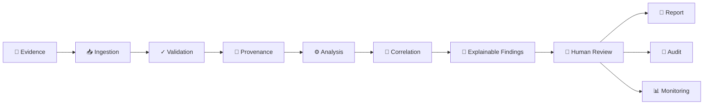
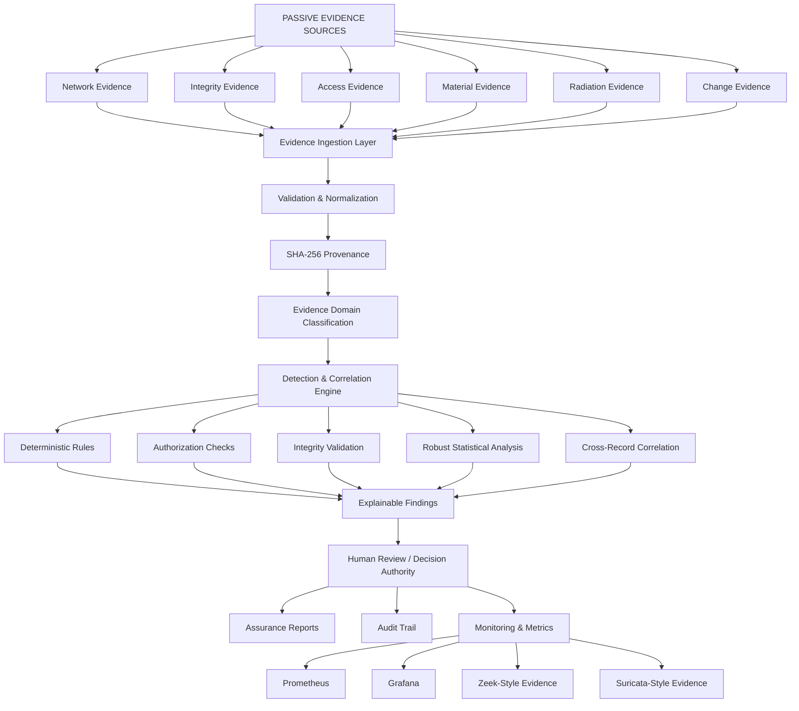
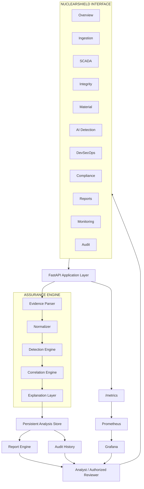
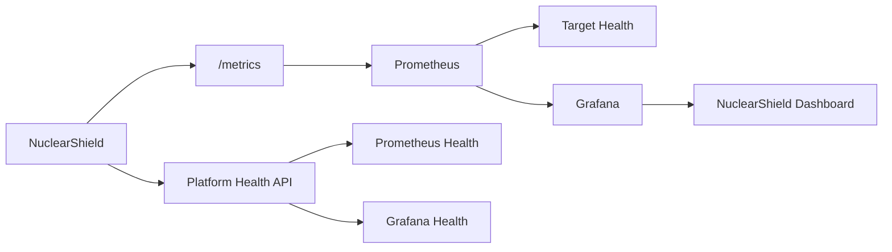
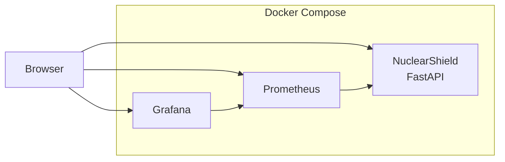
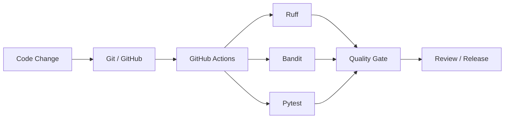

<div align="center">


# ☢️ NuclearShield

### Advanced Nuclear Cybersecurity Assurance Platform

**Defensive · Read-Only · Evidence-Driven · Explainable · Auditable**

**Version 1.0.0**

NuclearShield is a defensive cybersecurity assurance workstation that transforms passive security evidence into explainable findings, correlations, monitoring intelligence, reports, and auditable human decisions — without sending commands to operational technology.

<br>


</div>

---

## Safety Authority

> [!IMPORTANT]
> **NuclearShield is a defensive, read-only educational demonstrator.**
>
> Every included demonstration record is fictional and synthetic.
>
> NuclearShield has **no plant-control capability** and must never be connected to a real nuclear facility, SCADA/I&C network, safety system, physical-access system, nuclear material-accounting system, or production operational environment.

### READ-ONLY BOUNDARY

**Observe → Verify → Analyze → Correlate → Explain → Report**

> [!NOTE]
> **Human authority remains the final decision boundary.**
>
> NuclearShield ends at evidence-backed decision support. Operational authority remains outside the platform.

---

# Quick Start

## Requirements

Before running NuclearShield, install:

- Git
- Docker Desktop
- Docker Compose v2
- Windows 10/11
- Modern web browser

Clone the repository:

```powershell
git clone https://github.com/ruveeha33/NuclearShield.git
cd NuclearShield
```

### Windows — Recommended

Double-click:

```text
START-NUCLEARSHIELD.cmd
```

Or run:

```powershell
powershell -ExecutionPolicy Bypass -File .\start-nuclearshield.ps1
```

The launcher automatically:

- checks Docker;
- starts Docker Desktop when available but not ready;
- validates Docker Compose;
- detects port conflicts;
- selects safe alternative ports when necessary;
- builds the NuclearShield application;
- starts Prometheus and Grafana;
- waits for application health;
- displays the active URLs; and
- opens NuclearShield in the browser.

> [!TIP]
> NuclearShield does not terminate unrelated processes simply to reclaim a preferred port. If a preferred port is unavailable, the launcher selects a safe alternative and reports the active URL.

---

# NuclearShield Workflow

NuclearShield follows an **evidence-to-decision** model.



### Evidence → Analysis → Explanation → Human Decision

> [!IMPORTANT]
> NuclearShield does not turn a detection directly into an operational action.
>
> It deliberately separates **machine-assisted analysis** from **human authority**.

---

# How NuclearShield Works



NuclearShield preserves the relationship between evidence, analysis, correlation, explanation, reporting, monitoring, and human review.

> [!NOTE]
> Findings are produced from uploaded or synthetic evidence. They remain subject to human interpretation and independent verification.

---

# What NuclearShield Does

NuclearShield turns passive defensive evidence into a structured cybersecurity assurance workflow.

It is designed to answer:

> **What happened?**
>
> **Which evidence supports it?**
>
> **Why was it detected?**
>
> **How confident is the analysis?**
>
> **What events are related?**
>
> **What should be reviewed next?**
>
> **Who retains decision authority?**

The platform focuses on **defensible evidence and explainable decision support**, not autonomous operational response.

---

# Platform Architecture



> [!IMPORTANT]
> NuclearShield's architecture terminates at **analysis, explanation, reporting, monitoring, audit, and human review**.
>
> There is no application-to-plant command path.

---

# Evidence Ingestion

NuclearShield accepts passive defensive evidence in:

| Format | Support |
|---|---|
| CSV | Yes |
| JSON | Yes |
| JSONL | Yes |
| NDJSON | Yes |
| Zeek ASCII `.log` | Yes |

Zeek `.log` evidence requires a `#fields` header.

The ingestion workflow follows:

```text
Upload
   ↓
File Validation
   ↓
Schema Adaptation
   ↓
Normalization
   ↓
Record Validation
   ↓
SHA-256 Provenance
   ↓
Domain Classification
   ↓
Analysis
```

The demonstration limits are:

```text
Maximum file size : 10 MB
Maximum records   : 50,000
```

> [!NOTE]
> Uploaded evidence is treated as **untrusted input**.
>
> Successful ingestion means the evidence was accepted for analysis. It does not establish that the underlying event is genuine.

---

# Evidence Provenance

NuclearShield uses SHA-256 provenance to maintain a traceable relationship between supplied evidence and analytical output.

```text
Original Evidence
       ↓
Validation
       ↓
SHA-256 Provenance
       ↓
Normalized Evidence
       ↓
Analysis
       ↓
Findings
       ↓
Report / Audit
```

Provenance supports:

- evidence traceability;
- reproducibility;
- analysis verification;
- audit review; and
- report integrity.

> [!IMPORTANT]
> Provenance identifies the evidence used by NuclearShield. It does not independently validate the truth or authenticity of the real-world event represented by that evidence.

---

# Flexible Evidence Schema

NuclearShield recognizes common field alternatives rather than requiring every source to use exactly the same schema.

For the strongest analysis, evidence can include:

```text
event_id
timestamp
event_type
source
value
baseline
authorized
integrity
actor
asset
```

Supported evidence domains include:

```text
network
integrity
access
material
radiation
change
```

This allows different synthetic defensive evidence sources to enter the same assurance workflow while preserving validation boundaries.

> [!WARNING]
> A NuclearShield finding represents an **analytical result**.
>
> It is not proof that a real-world nuclear, cybersecurity, safeguards, radiation, or industrial event occurred.

---

# Explainable Detection Engine

NuclearShield avoids unexplained alert generation.

A finding can contain:

```text
Event ID
Severity
Confidence
Detection Engine
Reasons
Contributors
Related Events
Human Authorization Requirement
```

The platform combines several defensive detection paths.

### Deterministic Rules

Known evidence conditions are evaluated through transparent logic.

### Authorization Checks

Evidence can be evaluated for declared authorization state.

### Integrity Validation

Integrity-related records can be checked for declared mismatches or validation failures.

### Robust Statistical Analysis

Where sufficient peer-group numeric evidence exists, NuclearShield can use robust anomaly analysis.

> [!NOTE]
> Statistical analysis is used as **decision-support evidence**, not as proof of malicious activity.
>
> An anomaly indicates that evidence may deserve review. It does not independently establish cause, intent, or compromise.

### Correlation

Related records can be associated through shared evidence characteristics such as actors, assets, and event relationships.

> [!NOTE]
> Correlation provides analytical context. A relationship between evidence records does not automatically establish causation.

---

# Zeek & Suricata Evidence

NuclearShield includes passive network-security evidence support inspired by common Zeek and Suricata evidence formats.

### Zeek-Style Evidence

```text
sample-data/06-zeek-conn-synthetic.log
```

Zeek-style evidence can contribute:

- source and destination context;
- protocol observations;
- service information;
- connection behavior; and
- network relationships.

### Suricata-Style Evidence

```text
sample-data/07-suricata-eve-synthetic.jsonl
```

Suricata-style evidence can contribute:

- IDS alerts;
- signature context;
- event metadata; and
- defensive network observations.

> [!WARNING]
> The Monitoring workspace does **not** represent live nuclear-facility telemetry.
>
> Zeek and Suricata consoles display uploaded or synthetic defensive evidence only.

---

# NuclearShield Workspaces

## Overview

Provides the high-level assurance picture:

- analyzed evidence;
- finding counts;
- severity information;
- evidence-domain information;
- recent analyses; and
- platform status.

---

## Ingestion

The primary entry point for evidence analysis.

Users can:

- upload supported evidence;
- inspect ingestion results;
- use the built-in synthetic demonstration;
- review evidence provenance; and
- create a persistent analysis record.

---

## SCADA

Provides a defensive view of industrial-control-oriented evidence.

> [!CAUTION]
> The SCADA workspace is **passive and read-only**.
>
> It does not:
>
> - write PLC logic;
> - issue SCADA commands;
> - modify set points;
> - manipulate field devices;
> - control physical processes; or
> - create an operational control pathway.

---

## Integrity

Surfaces integrity-oriented evidence and associated detection results.

The purpose is to support review of declared integrity state rather than automatically change system configuration.

---

## Material

Provides synthetic safeguards-oriented evidence views for educational analysis.

> [!IMPORTANT]
> No real nuclear-material records are included.
>
> Material-related evidence bundled with NuclearShield is fictional and synthetic.

---

## AI Detection

Displays explainable findings and their analytical context.

The emphasis is:

**why the finding exists**, not simply that an alert was generated.

The workspace can expose:

- detection method;
- severity;
- confidence;
- contributing evidence;
- detection reasons;
- related events; and
- authorization context.

> [!NOTE]
> AI-supported and statistical analysis does not replace analyst review, independent verification, or human decision authority.

---

## DevSecOps

Represents software-assurance and quality-gate information associated with the NuclearShield development lifecycle.

The repository includes:

- automated tests;
- linting;
- static security analysis; and
- GitHub Actions CI.

---

## Compliance

Provides evidence-oriented framework mappings.

These mappings demonstrate how collected evidence may be organized against assurance themes.

> [!IMPORTANT]
> Evidence mapping is **not certification, regulatory approval, or compliance attestation**.

---

## Reports

Transforms analysis results into structured professional assurance reports.

Reports can include:

- analysis context;
- evidence provenance;
- findings;
- severity;
- confidence;
- contributing evidence;
- detection method;
- recommended measures;
- decision authority;
- evidence mapping; and
- audit-oriented context.

Reports can be:

- viewed in-browser;
- printed; or
- downloaded as HTML.

The downloaded report embeds NuclearShield branding for offline viewing.

> [!NOTE]
> Reports are decision-support artifacts. They do not constitute regulatory findings, engineering authorization, nuclear safety certification, or authorization for operational action.

---

## Monitoring

Provides platform and passive security-monitoring visibility through:

- Prometheus;
- Grafana;
- NuclearShield metrics;
- Zeek-style evidence;
- Suricata-style evidence; and
- platform health information.

---

## Audit

Maintains traceable platform activity.

The audit system is designed so that deleting an analyzed-file record does not silently erase the associated audit history.

> [!IMPORTANT]
> Analysis lifecycle and audit history are intentionally separated to preserve historical accountability.

---

# Monitoring Architecture



NuclearShield checks actual service health.

> [!NOTE]
> If Prometheus or Grafana is unavailable, NuclearShield reports the service as unavailable rather than displaying a false success state.

---

# Default Services

When the preferred ports are available:

| Service | URL |
|---|---|
| NuclearShield | `http://localhost:8000` |
| Assurance Report | `http://localhost:8000/api/report` |
| Prometheus | `http://localhost:9090` |
| Prometheus Targets | `http://localhost:9090/targets` |
| Grafana | `http://localhost:3000` |

If a preferred port is unavailable, the launcher selects another available port.

Selected ports are recorded in:

```text
.runtime-ports.env
```

> [!TIP]
> If the launcher assigns an alternative port, use the URL displayed by the launcher rather than assuming the default port is active.

---

# Docker Architecture

The complete platform runs as a Docker Compose stack.



Start manually:

```powershell
docker compose up --build -d
```

Check service status:

```powershell
docker compose ps
```

View logs:

```powershell
docker compose logs -f
```

Stop the platform:

```powershell
docker compose down
```

Remove demonstration volumes only when intentionally clearing persistent demonstration data:

```powershell
docker compose down --volumes
```

> [!CAUTION]
> `docker compose down --volumes` removes Docker volumes associated with the NuclearShield Compose project.
>
> Use it only when persistent demonstration data is intentionally being cleared.

---

# Intelligent Port Handling

The Windows launcher checks:

```text
8000 → NuclearShield
9090 → Prometheus
3000 → Grafana
```

If another application already owns one of these ports, NuclearShield does **not** terminate that application.

Instead:

```text
Preferred Port
      ↓
Availability Check
      ↓
Occupied?
  ↙         ↘
No           Yes
↓             ↓
Use It     Find Next Free Port
              ↓
         Save Runtime Port
```

The active assignments are stored in:

```text
.runtime-ports.env
```

> [!TIP]
> This allows NuclearShield to coexist with other Docker stacks and local development environments without forcibly reclaiming their ports.

---

# Testing

For local development testing with Python 3.12:

Create the environment:

```powershell
py -3.12 -m venv .venv
```

Activate:

```powershell
.venv\Scripts\Activate.ps1
```

Install dependencies:

```powershell
python -m pip install --upgrade pip
pip install -e ".[dev]"
```

Run tests:

```powershell
pytest -q
```

Lint:

```powershell
ruff check app tests
```

Run static security analysis:

```powershell
bandit -q -r app -x app/static
```

> [!NOTE]
> Passing automated tests validates the tested software behavior. It does not constitute nuclear-sector certification, regulatory approval, safety validation, or authorization for operational deployment.

---

# DevSecOps Pipeline



The workflow is stored in:

```text
.github/workflows/ci.yml
```

The pipeline provides automated software-quality and defensive-security checks before review.

> [!IMPORTANT]
> DevSecOps quality gates provide software-development assurance. They do not represent nuclear regulatory certification or operational qualification.

---

# v1.0.0 Platform Verification

The v1.0.0 release represents the verified public baseline of NuclearShield.

Platform verification covers areas including:

- end-to-end platform behavior;
- visual hierarchy;
- landing-page presentation;
- trust architecture;
- report branding;
- offline report presentation;
- evidence-driven monitoring;
- Zeek/Suricata evidence consoles;
- persistent analysis behavior;
- audit/history behavior;
- Prometheus/Grafana health behavior;
- JavaScript syntax validation;
- Python source validation; and
- automated regression testing.

> [!NOTE]
> Platform verification describes the tested software state of NuclearShield v1.0.0.
>
> It must not be interpreted as certification or validation for operational nuclear deployment.

---

# Repository Structure

```text
NuclearShield/
│
├── app/
│   ├── main.py
│   ├── analyzer.py
│   ├── store.py
│   │
│   └── static/
│       ├── app.js
│       ├── styles.css
│       ├── report.css
│       └── assets/
│
├── data/
│
├── docs/
│
├── monitoring/
│   ├── prometheus.yml
│   └── grafana/
│
├── sample-data/
│
├── scripts/
│
├── tests/
│
├── .github/
│   └── workflows/
│
├── .env.example
├── Dockerfile
├── docker-compose.yml
├── START-NUCLEARSHIELD.cmd
├── start-nuclearshield.ps1
├── pyproject.toml
├── SECURITY.md
├── LICENSE
└── README.md
```

---

# Architecture and Documentation

NuclearShield uses the README for the primary platform overview while deeper technical material belongs in the project's documentation.

The architecture follows a clear evidence-to-decision path:

```text
Passive Evidence
      ↓
Ingestion
      ↓
Validation & Provenance
      ↓
Domain Classification
      ↓
Analysis
      ↓
Correlation
      ↓
Explainable Findings
      ↓
Reports / Monitoring / Audit
      ↓
Human Review
```

The architecture emphasizes:

- evidence provenance;
- input validation;
- domain classification;
- explainable detection;
- statistical decision support;
- evidence correlation;
- passive network evidence;
- reporting;
- auditability;
- observability;
- reproducible deployment;
- software quality gates;
- explicit operational safety boundaries; and
- human decision authority.

> [!IMPORTANT]
> NuclearShield architecture diagrams describe the **software demonstrator and its defensive trust boundaries**.
>
> They do not describe, reproduce, or authorize the architecture of a real nuclear facility.

---

# Security Model

NuclearShield intentionally excludes operational-control capability.

The project does **not** provide:

```text
✗ Plant-control commands
✗ PLC manipulation
✗ SCADA write operations
✗ Exploit logic
✗ Real nuclear facility credentials
✗ Real nuclear material records
✗ Production plant topology
✗ Real process set points
✗ Safety-system manipulation
```

NuclearShield is designed around:

```text
✓ Passive evidence
✓ Read-only analysis
✓ Evidence provenance
✓ Explainable findings
✓ Human authorization
✓ Auditability
✓ Defensive monitoring
✓ Synthetic demonstrations
✓ Reproducible analysis
✓ Explicit safety boundaries
```

> [!CAUTION]
> NuclearShield's read-only boundary is intentional.
>
> The platform must not be extended into a direct operational-control path for nuclear plant systems, PLCs, SCADA/I&C, safety systems, physical-access systems, safeguards systems, or nuclear material-accounting systems.

See:

[`SECURITY.md`](SECURITY.md)

for the repository's safe-use boundary.

---

# Standards & Compliance Scope

NuclearShield can organize evidence themes relevant to nuclear cybersecurity and assurance frameworks.

The project includes evidence-oriented mappings associated with areas such as:

- IEC 62645;
- NRC RG 5.71; and
- IAEA cybersecurity guidance.

These mappings are provided for **educational and demonstrative purposes**.

> [!IMPORTANT]
> **Framework mapping does not mean certification.**
>
> NuclearShield does not certify compliance, provide regulatory approval, replace qualified assessment, or establish that a real nuclear facility satisfies a standard.

Real-world cybersecurity, safety, safeguards, and regulatory decisions remain the responsibility of qualified organizations and authorities.

---

# Responsible AI Disclosure

AI tools assisted with portions of:

- code development;
- documentation;
- testing support; and
- original visual development.

NuclearShield's analytical behavior remains inspectable.

The platform exposes:

- deterministic rules;
- statistical methods;
- correlation logic;
- confidence;
- detection reasons; and
- contributing evidence.

> [!NOTE]
> NuclearShield does **not** represent a validated nuclear-sector machine-learning model.
>
> AI-supported analysis does not replace human authority, qualified assessment, or independent verification.

---

# Responsible Use

NuclearShield is intended for:

- cybersecurity education;
- defensive demonstrations;
- evidence-analysis demonstrations;
- DevSecOps demonstrations;
- academic presentations;
- assurance workflow research; and
- synthetic cybersecurity experimentation.

> [!WARNING]
> NuclearShield must not be connected to operational nuclear or industrial-control environments.

---

# Limitations

NuclearShield is an educational and defensive cybersecurity assurance platform.

Its output is not:

```text
✗ Nuclear safety certification
✗ Regulatory approval
✗ Compliance certification
✗ Engineering authorization
✗ Operational authorization
✗ Proof of malicious activity
✗ A replacement for qualified analysts
✗ A plant-control system
```

Real-world deployment would require, among other things:

- explicit authorization;
- site-specific architecture;
- validated security controls;
- regulatory review;
- independent verification;
- change management;
- cybersecurity governance;
- qualified personnel; and
- applicable safety processes.

> [!WARNING]
> Successful demonstration or testing of NuclearShield does not establish suitability for a real nuclear environment.

---

# License

NuclearShield is released under the **MIT License**.

See:

[`LICENSE`](LICENSE)

---

# Author

### Ruveeha Ashfaq

**Co-Founder — HR Presents**

Focused on defensive cybersecurity, DevOps, cloud, Linux, containerization, OT/SCADA security, and evidence-driven security platforms.

GitHub:

[@ruveeha33](https://github.com/ruveeha33)

---

<div align="center">

## NuclearShield

### Evidence First. Human Authority Preserved.

**Defensive · Read-Only · Evidence-Driven · Explainable · Auditable**

**v1.0.0**

</div>
