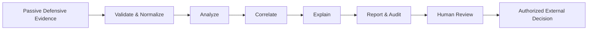
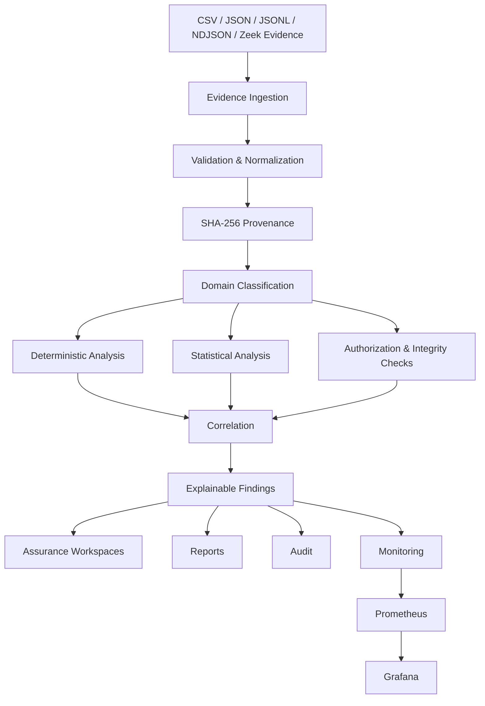
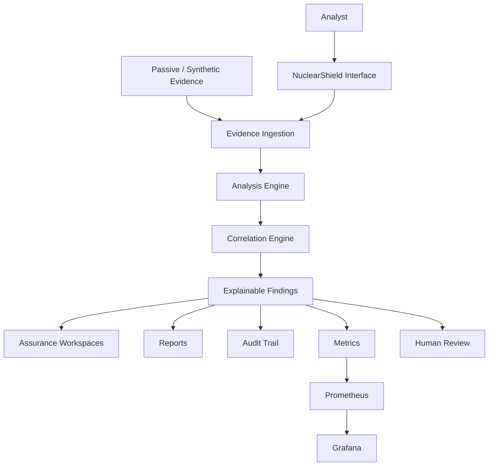
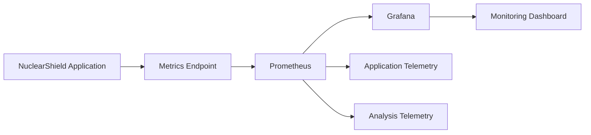
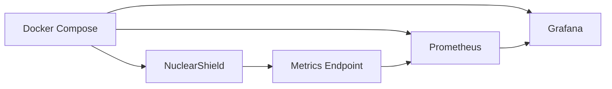
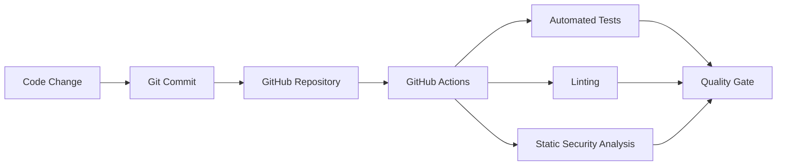

<p align="center">
  
</p>

<h1 align="center">NuclearShield</h1>

<h3 align="center">Advanced Nuclear Cybersecurity Assurance Platform</h3>

<p align="center">
  <strong>Defensive · Read-Only · Evidence-Driven · Explainable · Auditable</strong>
</p>

<p align="center">
  <strong>Version 1.0.0</strong>
</p>

<p align="center">
  NuclearShield is a defensive cybersecurity assurance workstation that transforms passive security evidence into explainable findings, correlations, monitoring intelligence, reports, and auditable human decisions — without sending commands to operational technology.
</p>

<p align="center">
  
  
  
  
  
  
  
</p>

---

## Safety Authority

> [!IMPORTANT]
> **NuclearShield is a defensive, read-only educational demonstrator.**
>
> Every included demonstration record is fictional and synthetic.
>
> NuclearShield has **no plant-control capability** and must never be connected to a real nuclear facility, SCADA/I&C network, safety system, physical-access system, nuclear material-accounting system, or production operational environment.

### Read-Only Boundary

**Observe → Verify → Analyze → Explain → Report**

> [!NOTE]
> **Human authority remains the final decision boundary.**
>
> NuclearShield provides evidence-backed decision support. Operational authority remains outside the application.

---

# Quick Start

## Requirements

Before running NuclearShield, install:

- Git
- Docker Desktop
- Docker Compose v2
- Windows 10/11
- A modern web browser

Clone the repository:

```bash
git clone https://github.com/ruveeha33/NuclearShield.git
cd NuclearShield
```

### Windows — Recommended

Double-click:

```text
START-NUCLEARSHIELD.cmd
```

Or run:

```powershell
powershell -ExecutionPolicy Bypass -File .\start-nuclearshield.ps1
```

The launcher automatically:

- checks Docker;
- starts Docker Desktop when available but not ready;
- validates Docker Compose;
- detects port conflicts;
- selects safe alternative ports when necessary;
- builds the NuclearShield application;
- starts Prometheus and Grafana;
- waits for application health;
- displays the active URLs; and
- opens NuclearShield in the browser.

> [!TIP]
> The launcher does not terminate unrelated applications simply to reclaim a preferred port. If a preferred port is already occupied, NuclearShield can use another available port.

---

# NuclearShield Workflow

NuclearShield follows an **evidence-to-decision** model.



### Evidence → Analysis → Explanation → Human Decision

> [!WARNING]
> NuclearShield does not turn a detection directly into an operational action.
>
> Analysis results require human review and, where appropriate, independent verification.

The platform preserves the separation between:

**machine-assisted analysis** and **human authority**.

---

# How NuclearShield Works

NuclearShield processes passive defensive evidence through a structured assurance workflow.



The workflow is designed so that evidence remains traceable from ingestion through analysis, explanation, reporting, monitoring, and audit.

---

# What NuclearShield Does

NuclearShield turns passive defensive evidence into a structured cybersecurity assurance workflow.

It is designed to answer:

> **What happened?**
>
> **Which evidence supports it?**
>
> **Why was it detected?**
>
> **How confident is the analysis?**
>
> **What events are related?**
>
> **What should be reviewed next?**
>
> **Who retains decision authority?**

The platform focuses on **defensible evidence**, not autonomous operational response.

---

# Platform Architecture

NuclearShield separates evidence ingestion, analytical processing, correlation, reporting, monitoring, audit, and human decision authority.



> [!IMPORTANT]
> The architecture terminates at **decision support**.
>
> There is no NuclearShield-to-plant operational command path.

---

# Evidence Ingestion

NuclearShield accepts passive defensive evidence in:

| Format | Support |
|---|---:|
| CSV | Yes |
| JSON | Yes |
| JSONL | Yes |
| NDJSON | Yes |
| Zeek ASCII `.log` | Yes |

Zeek `.log` evidence requires a `#fields` header.

The ingestion layer performs:

```text
Upload
   ↓
File Validation
   ↓
Schema Adaptation
   ↓
Normalization
   ↓
Record Validation
   ↓
SHA-256 Provenance
   ↓
Domain Classification
   ↓
Analysis
```

The demonstration limits are:

```text
Maximum file size : 10 MB
Maximum records   : 50,000
```

> [!NOTE]
> Evidence is treated as **untrusted input**.
>
> A finding represents an analytical result. It does not prove that a real-world nuclear, cyber, safety, safeguards, or industrial event occurred.

---

# Evidence Provenance

Evidence provenance is part of NuclearShield's assurance model.

Each analysis preserves the relationship between:

```text
Original Evidence
       ↓
Validation
       ↓
SHA-256 Provenance
       ↓
Normalized Evidence
       ↓
Analysis
       ↓
Explainable Findings
       ↓
Report / Audit
```

This helps identify which evidence produced a particular analysis and supports reproducibility and audit review.

---

# Flexible Evidence Schema

NuclearShield recognizes common field alternatives rather than requiring every source to use exactly the same schema.

For the strongest analysis, evidence can include:

```text
event_id
timestamp
event_type
source
value
baseline
authorized
integrity
actor
asset
```

Supported evidence domains include:

```text
network
integrity
access
material
radiation
change
```

> [!NOTE]
> Schema flexibility does not reduce validation requirements. Evidence remains untrusted until it passes the relevant ingestion and normalization stages.

---

# Explainable Detection Engine

NuclearShield avoids unexplained alert generation.

A finding can contain:

```text
Event ID
Severity
Confidence
Detection Engine
Reasons
Contributors
Related Events
Human Authorization Requirement
```

The platform combines several defensive detection paths.

### Deterministic Rules

Known evidence conditions are evaluated through transparent logic.

### Authorization Checks

Evidence can be evaluated for declared authorization state.

### Integrity Validation

Integrity-related records can be checked for declared mismatches or validation failures.

### Robust Statistical Analysis

Where sufficient peer-group numeric evidence exists, NuclearShield can use robust anomaly analysis.

> [!NOTE]
> Statistical analysis is **decision-support evidence**. An anomaly is not automatically evidence of malicious activity.

### Correlation

Related records can be associated through shared evidence characteristics such as actors, assets, domains, and event relationships.

Correlation provides context for human assessment rather than automatically establishing causation.

---

# Zeek & Suricata Evidence

NuclearShield includes passive network-security evidence support inspired by common Zeek and Suricata evidence formats.

### Zeek-Style Evidence

```text
sample-data/06-zeek-conn-synthetic.log
```

Zeek-style evidence can contribute:

- source and destination context;
- protocol observations;
- service information;
- connection behavior; and
- network relationships.

### Suricata-Style Evidence

```text
sample-data/07-suricata-eve-synthetic.jsonl
```

Suricata-style evidence can contribute:

- IDS alerts;
- signature context;
- security-event metadata; and
- defensive network observations.

> [!WARNING]
> The Monitoring workspace does **not** represent live nuclear-facility telemetry.
>
> Sensor consoles display uploaded or synthetic defensive evidence only.

---

# NuclearShield Workspaces

## Overview

Provides the high-level assurance picture:

- analyzed evidence;
- finding counts;
- severity information;
- evidence-domain information;
- recent analyses; and
- platform status.

---

## Ingestion

The entry point for evidence analysis.

Users can:

- upload supported evidence;
- inspect ingestion results;
- use the built-in synthetic demonstration; and
- create a persistent analysis record.

---

## SCADA

Provides a defensive view of industrial-control-oriented evidence.

> [!CAUTION]
> The SCADA workspace is **passive and read-only**.
>
> It does not write PLC logic, issue SCADA commands, modify setpoints, manipulate field devices, or control physical processes.

---

## Integrity

Surfaces integrity-oriented evidence and associated detection results.

The purpose is to support review of declared integrity state rather than automatically changing system configuration.

---

## Material

Provides synthetic safeguards-oriented evidence views for educational analysis.

> [!IMPORTANT]
> No real nuclear-material records are included.

---

## AI Detection

Displays explainable findings and their analytical context.

The emphasis is:

**why the finding exists**, not simply that an alert was generated.

---

## DevSecOps

Represents software-assurance and quality-gate information associated with the NuclearShield development lifecycle.

The repository includes:

- automated tests;
- linting;
- static security analysis; and
- GitHub Actions CI.

---

## Compliance

Provides evidence-oriented framework mappings.

These mappings help demonstrate how collected evidence may be organized against assurance themes.

> [!IMPORTANT]
> Framework mapping is **not certification or compliance attestation**.

---

## Reports

Transforms analysis results into a structured assurance report.

Reports include:

- analysis context;
- findings;
- severity;
- confidence;
- evidence;
- detection method;
- recommended measures;
- decision authority;
- evidence mapping; and
- audit-oriented context.

Reports can be:

- viewed in-browser;
- printed; or
- downloaded as HTML.

The downloaded report embeds NuclearShield branding for offline viewing.

---

## Monitoring

Provides platform and passive security-monitoring visibility through:

- Prometheus;
- Grafana;
- NuclearShield metrics;
- Zeek-style evidence;
- Suricata-style evidence; and
- platform health information.

---

## Audit

Maintains traceable platform activity.

The audit system is designed so that deleting an analyzed-file record does not silently erase the associated audit history.

---

# Monitoring Architecture



NuclearShield checks actual service health.

> [!NOTE]
> If Prometheus or Grafana is unavailable, the interface reports the service as unavailable rather than displaying a false success state.

---

# Default Services

When the preferred ports are available:

| Service | URL |
|---|---|
| NuclearShield | `http://localhost:8000` |
| Assurance Report | `http://localhost:8000/api/report` |
| Prometheus | `http://localhost:9090` |
| Prometheus Targets | `http://localhost:9090/targets` |
| Grafana | `http://localhost:3000` |

If a preferred port is unavailable, the launcher selects another available port.

Selected ports are recorded in:

```text
.runtime-ports.env
```

> [!TIP]
> Always use the URLs displayed by the launcher when a preferred port has been replaced by an alternative.

---

# Docker Architecture

The complete platform runs as a Docker Compose stack.



Start manually:

```bash
docker compose up --build -d
```

Check:

```bash
docker compose ps
```

View logs:

```bash
docker compose logs -f
```

Stop:

```bash
docker compose down
```

Remove demonstration volumes only when intentionally clearing persistent demonstration data:

```bash
docker compose down --volumes
```

> [!WARNING]
> `docker compose down --volumes` removes Docker volumes associated with the Compose project. Use it only when persistent demonstration data is intentionally being cleared.

---

# Intelligent Port Handling

The Windows launcher checks:

```text
8000 → NuclearShield
9090 → Prometheus
3000 → Grafana
```

If another application already owns one of these ports, NuclearShield does **not** kill that application.

Instead:

```text
Preferred Port
      ↓
Availability Check
      ↓
   Occupied?
   ↙      ↘
 No        Yes
 ↓          ↓
Use It   Find Next Free Port
             ↓
        Save Runtime Port
```

The active runtime ports are stored in:

```text
.runtime-ports.env
```

This allows NuclearShield to coexist with other local Docker and development environments.

---

# Testing

For local development testing with Python 3.12:

Create the environment:

```powershell
py -3.12 -m venv .venv
```

Activate:

```powershell
.venv\Scripts\Activate.ps1
```

Install development dependencies:

```powershell
python -m pip install --upgrade pip
pip install -e ".[dev]"
```

Run tests:

```powershell
pytest -q
```

Lint:

```powershell
ruff check app tests
```

Run static security analysis:

```powershell
bandit -q -r app -x app/static
```

> [!NOTE]
> Local test success validates the tested software behavior. It does not constitute nuclear-sector certification, regulatory approval, or operational validation.

---

# DevSecOps Pipeline



The workflow is stored in:

```text
.github/workflows/ci.yml
```

The pipeline supports software quality and defensive assurance.

It does not represent nuclear regulatory certification.

---

# Repository Structure

```text
NuclearShield/
│
├── app/
│   ├── main.py
│   ├── analyzer.py
│   ├── store.py
│   │
│   └── static/
│       ├── app.js
│       ├── styles.css
│       ├── report.css
│       └── assets/
│
├── data/
│
├── docs/
│
├── monitoring/
│   ├── prometheus.yml
│   └── grafana/
│
├── sample-data/
│
├── scripts/
│
├── tests/
│
├── .github/
│   └── workflows/
│
├── .env.example
├── Dockerfile
├── docker-compose.yml
├── START-NUCLEARSHIELD.cmd
├── start-nuclearshield.ps1
├── pyproject.toml
├── SECURITY.md
├── LICENSE
└── README.md
```

---

# Architecture and Documentation

NuclearShield separates its public project overview from deeper technical documentation.

The README explains the primary workflow and major system boundaries, while the `docs/` directory can provide deeper implementation and assurance documentation.

The core architecture follows:

```text
Passive Evidence
      ↓
Ingestion
      ↓
Validation & Provenance
      ↓
Domain Classification
      ↓
Analysis
      ↓
Correlation
      ↓
Explainable Findings
      ↓
Reports / Monitoring / Audit
      ↓
Human Review
```

Important architectural concerns include:

1. evidence provenance;
2. input validation;
3. domain classification;
4. explainable detection;
5. statistical decision support;
6. evidence correlation;
7. passive network monitoring;
8. reporting;
9. auditability;
10. observability;
11. containerized deployment;
12. failure handling;
13. software quality gates;
14. explicit operational safety boundaries; and
15. human decision authority.

> [!IMPORTANT]
> Architectural diagrams describe the NuclearShield software demonstration and its defensive trust boundaries. They do not describe or authorize a real nuclear facility architecture.

---

# Safety-Boundary Architecture

The most important NuclearShield architecture rule is the absence of an operational command path.

```text
REAL OR OPERATIONAL ENVIRONMENT
              │
              │  No direct NuclearShield control connection
              ▼
      ┌──────────────────┐
      │  Safety Boundary │
      └────────┬─────────┘
               │
               ▼
    Synthetic / Safely Exported
          Defensive Evidence
               │
               ▼
        NuclearShield
      Read-Only Analysis
               │
               ▼
         Human Review
               │
               ▼
    Independent Verification
               │
               ▼
 Authorized External Decision
```

> [!CAUTION]
> NuclearShield must not be extended into a direct control pathway for PLCs, SCADA/I&C, safety systems, physical-access systems, safeguards systems, or other operational nuclear technology.

---

# Security Model

NuclearShield intentionally excludes operational-control capability.

The project does **not** provide:

```text
✗ Plant-control commands
✗ PLC manipulation
✗ SCADA write operations
✗ Exploit logic
✗ Real nuclear facility credentials
✗ Real nuclear material records
✗ Production plant topology
✗ Real process setpoints
✗ Safety-system manipulation
```

NuclearShield is designed around:

```text
✓ Passive evidence
✓ Read-only analysis
✓ Evidence provenance
✓ Explainable findings
✓ Human authorization
✓ Auditability
✓ Defensive monitoring
✓ Synthetic demonstrations
✓ Reproducible analysis
✓ Explicit safety boundaries
```

See:

[`SECURITY.md`](SECURITY.md)

for the repository's safe-use boundary.

---

# Standards and Compliance Scope

NuclearShield can organize evidence themes relevant to nuclear cybersecurity and assurance frameworks.

The project includes evidence-oriented mappings associated with areas such as:

- IEC 62645;
- NRC RG 5.71; and
- IAEA cybersecurity guidance.

> [!IMPORTANT]
> **Framework mapping does not mean certification.**
>
> NuclearShield does not certify compliance, provide regulatory approval, replace qualified assessment, or establish that a real nuclear facility satisfies a standard.

Real-world cybersecurity, safety, safeguards, and regulatory decisions remain the responsibility of qualified organizations and authorities.

---

# Responsible AI Disclosure

AI tools assisted with portions of:

- code development;
- documentation;
- testing support; and
- original visual development.

NuclearShield's analytical behavior remains inspectable.

The platform exposes:

- deterministic rules;
- statistical methods;
- correlation logic;
- confidence;
- detection reasons; and
- contributing evidence.

> [!NOTE]
> NuclearShield does **not** represent a validated nuclear-sector machine-learning model.
>
> AI-supported analysis does not replace human authority.

---

# Responsible Use

NuclearShield is intended for:

- cybersecurity education;
- defensive demonstrations;
- evidence-analysis demonstrations;
- DevSecOps demonstrations;
- academic presentations;
- assurance workflow research; and
- synthetic cybersecurity experimentation.

> [!WARNING]
> NuclearShield must not be connected to operational nuclear or industrial-control environments.

---

# Limitations

NuclearShield is an educational and defensive cybersecurity assurance platform.

Its output is not:

```text
✗ Nuclear safety certification
✗ Regulatory approval
✗ Compliance certification
✗ Engineering authorization
✗ Operational authorization
✗ Proof of malicious activity
✗ A replacement for qualified analysts
✗ A plant-control system
```

A real-world deployment would require, among other things:

- explicit authorization;
- site-specific architecture;
- validated security controls;
- regulatory review;
- independent verification;
- change management;
- cybersecurity governance;
- qualified personnel; and
- applicable safety processes.

---

# License

NuclearShield is released under the **MIT License**.

See:

[`LICENSE`](LICENSE)

---

# Author

### Ruveeha Ashfaq

**Co-Founder, HR Presents**

Focused on defensive cybersecurity, DevOps, cloud, Linux, containerization, OT/SCADA security, and evidence-driven security platforms.

GitHub:

[@ruveeha33](https://github.com/ruveeha33)

---

<p align="center">
  
</p>

<h2 align="center">NuclearShield</h2>

<h3 align="center">Evidence First. Human Authority Preserved.</h3>

<p align="center">
  <strong>Defensive · Read-Only · Evidence-Driven · Explainable · Auditable</strong>
</p>

<p align="center">
  <strong>v1.0.0</strong>
</p>
