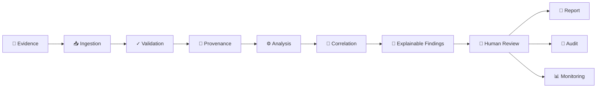
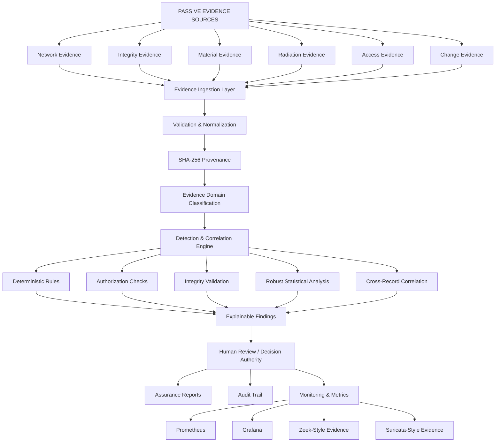
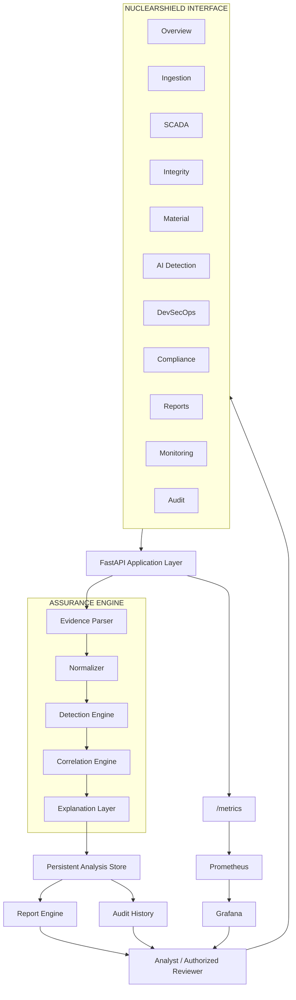
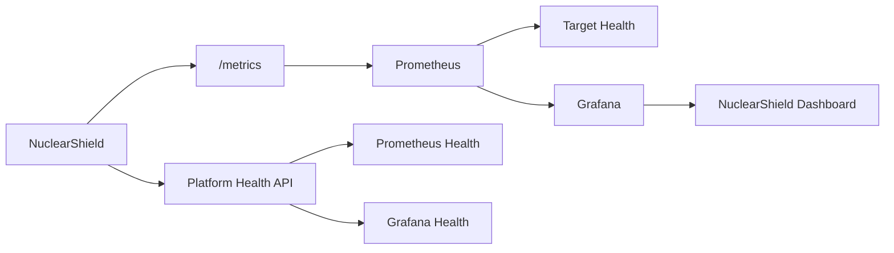
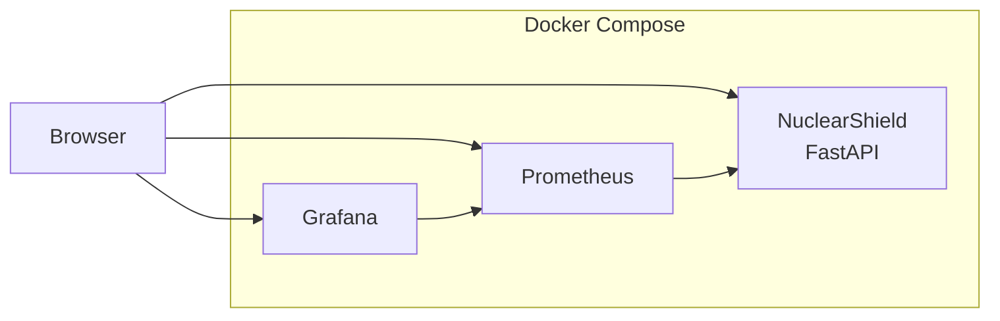
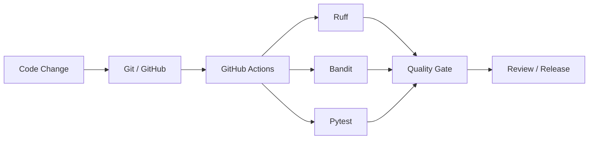

<div align="center">


# NuclearShield

### Advanced Nuclear Cybersecurity Assurance Platform

**Defensive · Read-Only · Evidence-Driven · Explainable · Auditable**

**Version 1.0.8 — Final Visual & Platform Audit**

NuclearShield is a defensive cybersecurity assurance workstation that transforms passive security evidence into explainable findings, correlations, monitoring intelligence, reports, and auditable human decisions — without sending commands to operational technology.

<br>


</div>

---

## Safety Authority

> [!IMPORTANT]
> **NuclearShield is a defensive, read-only educational demonstrator.**
>
> Every included record is fictional and synthetic.
>
> NuclearShield has **no plant-control capability** and must never be connected to a real nuclear facility, SCADA/I&C network, safety system, physical-access system, nuclear material-accounting system, or production operational environment.

### READ-ONLY BOUNDARY

**Observe → Verify → Analyze → Explain → Report**

> [!NOTE]
> **Human authority remains the final decision boundary.**
>
> NuclearShield provides evidence-backed decision support. Operational authority remains outside the platform.

---

# Quick Start

## Requirements

Before running NuclearShield, install:

- Git
- Docker Desktop
- Docker Compose v2
- Windows 10/11
- Modern web browser

Clone the repository:

```powershell
git clone https://github.com/ruveeha33/NuclearShield.git
cd NuclearShield
```

### Windows — Recommended

Double-click:

```text
START-NUCLEARSHIELD.cmd
```

Or run:

```powershell
powershell -ExecutionPolicy Bypass -File .\start-nuclearshield.ps1
```

The launcher automatically:

- checks Docker;
- starts Docker Desktop when available but not ready;
- validates Docker Compose;
- detects port conflicts;
- selects safe alternative ports when necessary;
- builds the NuclearShield application;
- starts Prometheus and Grafana;
- waits for application health;
- displays the active URLs; and
- opens NuclearShield in the browser.

> [!TIP]
> NuclearShield does not terminate unrelated processes simply to reclaim a preferred port. If a preferred port is unavailable, the launcher selects a safe alternative and reports the active URL.

---

# NuclearShield Workflow

NuclearShield follows an **evidence-to-decision** model.



### Evidence → Analysis → Explanation → Human Decision

> [!IMPORTANT]
> NuclearShield does not turn a detection directly into an operational action.
>
> The platform preserves a deliberate separation between **machine-assisted analysis** and **human authority**.

---

# How NuclearShield Works



> [!NOTE]
> The workflow is evidence-driven. Findings are derived from uploaded or synthetic evidence and remain subject to human interpretation and verification.

---

# What NuclearShield Does

NuclearShield turns passive defensive evidence into a structured assurance workflow.

It is designed to answer:

> **What happened?**
>
> **Which evidence supports it?**
>
> **Why was it detected?**
>
> **How confident is the analysis?**
>
> **What events are related?**
>
> **What should be reviewed next?**
>
> **Who retains decision authority?**

The platform focuses on **defensible evidence**, not autonomous operational response.

---

# Platform Architecture



> [!IMPORTANT]
> The architecture terminates at **analysis, explanation, reporting, monitoring, audit, and human review**.
>
> NuclearShield contains no application-to-plant command path.

---

# Evidence Ingestion

NuclearShield accepts passive defensive evidence in:

| Format | Support |
|---|---|
| CSV | Yes |
| JSON | Yes |
| JSONL | Yes |
| NDJSON | Yes |
| Zeek ASCII `.log` | Yes |

Zeek `.log` evidence requires a `#fields` header.

The ingestion layer performs:

```text
Upload
   ↓
File Validation
   ↓
Schema Adaptation
   ↓
Normalization
   ↓
Record Validation
   ↓
SHA-256 Provenance
   ↓
Domain Classification
   ↓
Analysis
```

The demonstration limits are:

```text
Maximum file size : 10 MB
Maximum records   : 50,000
```

> [!NOTE]
> Uploaded evidence is treated as **untrusted input**. Successful ingestion means the evidence was accepted for analysis; it does not establish the truth of the underlying event.

---

# Flexible Evidence Schema

NuclearShield recognizes common field alternatives rather than requiring every source to use exactly the same schema.

For the strongest analysis, evidence can include:

```text
event_id
timestamp
event_type
source
value
baseline
authorized
integrity
actor
asset
```

Supported evidence domains include:

```text
network
integrity
access
material
radiation
change
```

> [!WARNING]
> A NuclearShield finding represents an **analytical result**.
>
> It is not proof that a real-world nuclear, cybersecurity, safeguards, radiation, or industrial event occurred.

---

# Explainable Detection Engine

NuclearShield avoids unexplained alert generation.

A finding can contain:

```text
Event ID
Severity
Confidence
Detection Engine
Reasons
Contributors
Related Events
Human Authorization Requirement
```

The platform combines several defensive detection paths.

### Deterministic Rules

Known evidence conditions are evaluated through transparent logic.

### Authorization Checks

Evidence can be evaluated for declared authorization state.

### Integrity Validation

Integrity-related records can be checked for declared mismatches or validation failures.

### Robust Statistical Analysis

Where sufficient peer-group numeric evidence exists, NuclearShield can use robust anomaly analysis.

> [!NOTE]
> Statistical analysis is used as **decision-support evidence**, not as proof of malicious activity.
>
> An anomaly indicates that evidence deserves review; it does not independently establish cause or intent.

### Correlation

Related records can be associated through shared evidence characteristics such as actors, assets, and event relationships.

> [!NOTE]
> Correlation identifies relationships between evidence records. Correlation alone does not establish causation.

---

# Zeek & Suricata Evidence

NuclearShield includes passive network-security evidence support inspired by common Zeek and Suricata evidence formats.

### Zeek-style evidence

```text
sample-data/06-zeek-conn-synthetic.log
```

### Suricata-style evidence

```text
sample-data/07-suricata-eve-synthetic.jsonl
```

The Monitoring workspace presents evidence-driven sensor consoles.

> [!WARNING]
> These consoles do **not** represent live nuclear-facility telemetry.
>
> They display uploaded or synthetic defensive evidence only.

---

# NuclearShield Workspaces

## Overview

Provides the high-level assurance picture:

- analyzed evidence;
- finding counts;
- severity information;
- evidence-domain information;
- recent analyses; and
- platform status.

---

## Ingestion

The entry point for evidence analysis.

Users can:

- upload supported evidence;
- inspect ingestion results;
- use the built-in synthetic demonstration; and
- create a persistent analysis record.

---

## SCADA

Provides a defensive view of industrial-control-oriented evidence.

> [!CAUTION]
> The SCADA workspace is **passive and read-only**.
>
> It does not:
>
> - write PLC logic;
> - issue SCADA commands;
> - modify set points;
> - manipulate field devices; or
> - control physical processes.

---

## Integrity

Surfaces integrity-oriented evidence and associated detection results.

The purpose is to support review of declared integrity state rather than automatically change system configuration.

---

## Material

Provides synthetic safeguards-oriented evidence views for educational analysis.

> [!IMPORTANT]
> No real nuclear-material records are included.
>
> Material-related evidence included with NuclearShield is fictional and synthetic.

---

## AI Detection

Displays explainable findings and their analytical context.

The emphasis is:

**why the finding exists**, not simply that an alert was generated.

> [!NOTE]
> AI-supported or statistical analysis does not replace analyst review, independent verification, or human decision authority.

---

## DevSecOps

Represents software-assurance and quality-gate information associated with the NuclearShield development lifecycle.

The repository includes:

- automated tests;
- linting;
- static security analysis; and
- GitHub Actions CI.

---

## Compliance

Provides evidence-oriented framework mappings.

These mappings help demonstrate how collected evidence may be organized against assurance themes.

> [!IMPORTANT]
> Evidence mapping is **not certification, regulatory approval, or compliance attestation**.

---

## Reports

Transforms analysis results into a structured assurance report.

Reports include:

- analysis context;
- findings;
- severity;
- confidence;
- evidence;
- detection method;
- recommended measures;
- decision authority;
- evidence mapping; and
- audit-oriented context.

Reports can be:

- viewed in-browser;
- printed; or
- downloaded as HTML.

The downloaded report embeds NuclearShield branding for offline viewing.

> [!NOTE]
> Reports are decision-support artifacts. They do not constitute regulatory findings, engineering authorization, or nuclear safety certification.

---

## Monitoring

Provides platform and passive security-monitoring visibility through:

- Prometheus
- Grafana
- NuclearShield metrics
- Zeek-style evidence
- Suricata-style evidence
- platform health information

---

## Audit

Maintains traceable platform activity.

The audit system is designed so that deleting an analyzed-file record does not silently erase the associated audit history.

> [!IMPORTANT]
> Audit history and analyzed-file lifecycle are intentionally separated so that removal of an analysis record does not silently rewrite historical platform activity.

---

# Monitoring Architecture



NuclearShield checks actual service health.

> [!NOTE]
> If Prometheus or Grafana is unavailable, the interface reports the service as unavailable rather than showing a false success state.

---

# Default Services

When the preferred ports are available:

| Service | URL |
|---|---|
| NuclearShield | `http://localhost:8000` |
| Assurance Report | `http://localhost:8000/api/report` |
| Prometheus | `http://localhost:9090` |
| Prometheus Targets | `http://localhost:9090/targets` |
| Grafana | `http://localhost:3000` |

If a preferred port is unavailable, the launcher selects another available port.

Selected ports are recorded in:

```text
.runtime-ports.env
```

> [!TIP]
> When an alternative port is selected, use the active URLs printed by the NuclearShield launcher rather than assuming the preferred ports are still in use.

---

# Docker Architecture

The complete platform runs as a Docker Compose stack.



Start manually:

```powershell
docker compose up --build -d
```

Check:

```powershell
docker compose ps
```

Logs:

```powershell
docker compose logs -f
```

Stop:

```powershell
docker compose down
```

Remove demonstration volumes only when intentionally clearing persistent demo data:

```powershell
docker compose down --volumes
```

> [!CAUTION]
> `docker compose down --volumes` removes the Docker volumes associated with the Compose project.
>
> Use it only when you intentionally want to clear persistent demonstration data.

---

# Intelligent Port Handling

The Windows launcher checks:

```text
8000 → NuclearShield
9090 → Prometheus
3000 → Grafana
```

If another application already owns one of these ports, NuclearShield does **not** kill that application.

Instead:

```text
Preferred Port
      ↓
Availability Check
      ↓
Occupied?
  ↙         ↘
No           Yes
↓             ↓
Use It     Find Next Free Port
              ↓
         Save Runtime Port
```

This helps NuclearShield coexist safely with other local Docker and development environments.

> [!TIP]
> The active port assignments are written to `.runtime-ports.env`, making the selected runtime configuration explicit and inspectable.

---

# Testing

For local development testing with Python 3.12:

```powershell
py -3.12 -m venv .venv
```

Activate:

```powershell
.venv\Scripts\Activate.ps1
```

Install:

```powershell
python -m pip install --upgrade pip
pip install -e ".[dev]"
```

Run tests:

```powershell
pytest -q
```

Lint:

```powershell
ruff check app tests
```

Static security analysis:

```powershell
bandit -q -r app -x app/static
```

> [!NOTE]
> Passing software tests validates the tested implementation behavior. It does not constitute nuclear-sector validation, certification, regulatory approval, or authorization for operational deployment.

---

# DevSecOps Pipeline



The workflow is stored in:

```text
.github/workflows/ci.yml
```

> [!IMPORTANT]
> DevSecOps quality gates provide software-development assurance. They do not represent nuclear regulatory certification or operational qualification.

---

# v1.0.8 Final Visual & Platform Audit

The final v1.0.8 audit included:

- end-to-end platform review;
- visual hierarchy refinement;
- landing-page refinement;
- trust-architecture refinement;
- report branding;
- offline report-logo preservation;
- report print-color preservation;
- evidence-driven monitoring refinement;
- Zeek/Suricata console refinement;
- persistent analysis behavior;
- audit/history behavior checks;
- Prometheus/Grafana health behavior;
- missing-event-ID regression repair;
- JavaScript syntax validation;
- Python source syntax validation; and
- automated regression testing.

### Final Automated Test Result

```text
25 passed
```

> [!NOTE]
> The v1.0.8 audit records the tested state of this NuclearShield release. It should not be interpreted as certification or validation of the platform for operational nuclear deployment.

---

# Repository Structure

```text
NuclearShield/
│
├── app/
│   ├── main.py
│   ├── analyzer.py
│   ├── store.py
│   │
│   └── static/
│       ├── app.js
│       ├── styles.css
│       ├── report.css
│       └── assets/
│
├── data/
│
├── docs/
│
├── monitoring/
│   ├── prometheus.yml
│   └── grafana/
│
├── sample-data/
│
├── scripts/
│
├── tests/
│
├── .github/
│   └── workflows/
│
├── .env.example
├── Dockerfile
├── docker-compose.yml
├── START-NUCLEARSHIELD.cmd
├── start-nuclearshield.ps1
├── pyproject.toml
├── SECURITY.md
├── LICENSE
└── README.md
```

---

# Security Model

NuclearShield intentionally excludes operational control capability.

The project does **not** provide:

```text
✗ Plant-control commands
✗ PLC manipulation
✗ SCADA write operations
✗ Exploit logic
✗ Real nuclear facility credentials
✗ Real nuclear material records
✗ Production plant topology
✗ Real process set points
✗ Safety-system manipulation
```

NuclearShield is designed around:

```text
✓ Passive evidence
✓ Read-only analysis
✓ Explainable findings
✓ Human authorization
✓ Auditability
✓ Defensive monitoring
✓ Synthetic demonstrations
```

> [!CAUTION]
> NuclearShield's safety boundary is intentional.
>
> The platform must not be extended into a direct operational-control path for nuclear plant systems, PLCs, SCADA/I&C, safety systems, physical-access systems, or nuclear material-accounting systems.

See:

```text
SECURITY.md
```

for the repository's safe-use boundary.

---

# Standards & Compliance Scope

NuclearShield can organize evidence themes relevant to nuclear cybersecurity and assurance frameworks.

The project includes evidence-oriented mappings associated with areas such as:

- IEC 62645
- NRC RG 5.71
- IAEA cybersecurity guidance

These mappings are provided for **educational and demonstrative purposes**.

> [!IMPORTANT]
> **Framework mapping does not mean certification.**
>
> NuclearShield does not certify compliance, provide regulatory approval, replace qualified assessment, or establish that a real nuclear facility satisfies a standard.

Real-world cybersecurity, safety, safeguards, and regulatory decisions remain the responsibility of qualified organizations and authorities.

---

# Responsible AI Disclosure

AI tools assisted with portions of:

- code development;
- documentation;
- testing support; and
- original visual development.

NuclearShield's analytical behavior remains inspectable.

The platform exposes:

- deterministic rules;
- statistical methods;
- correlation logic;
- confidence;
- detection reasons; and
- contributing evidence.

> [!NOTE]
> NuclearShield does **not** represent a validated nuclear-sector machine-learning model.
>
> AI-supported analysis does not replace human authority, qualified assessment, or independent verification.

---

# Responsible Use

NuclearShield is intended for:

- cybersecurity education;
- defensive demonstrations;
- evidence-analysis demonstrations;
- DevSecOps demonstrations;
- academic presentations;
- assurance workflow research; and
- synthetic cybersecurity experimentation.

> [!WARNING]
> NuclearShield must not be connected to operational nuclear or industrial-control environments.

---

# License

NuclearShield is released under the **MIT License**.

See:

```text
LICENSE
```

---

# Author

### Ruveeha Ashfaq

**Co-Founder — HR Presents**

Focused on defensive cybersecurity, DevOps, cloud, Linux, containerization, and evidence-driven security platforms.

---

<div align="center">

## NuclearShield

### Evidence First. Human Authority Preserved.

**Defensive · Read-Only · Explainable · Auditable**

**v1.0.8**

</div>
