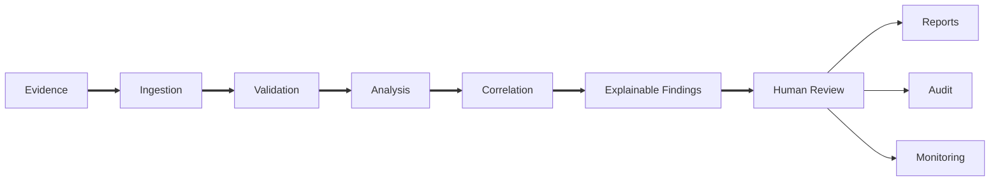
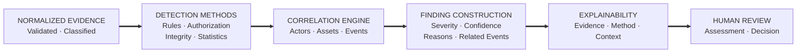
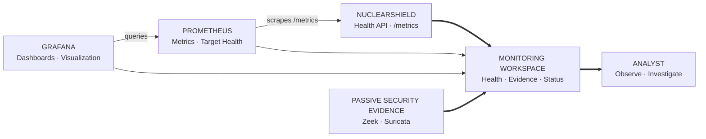
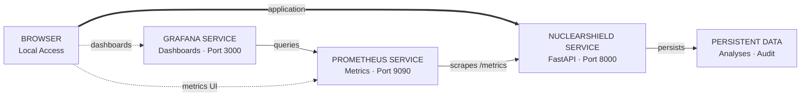
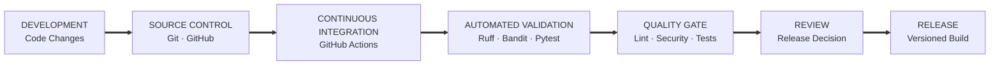

# 🔄 NuclearShield Workflow

NuclearShield follows a controlled **evidence-to-decision** workflow. Passive evidence is validated and analyzed before findings are presented for human review.



### Evidence → Analysis → Explanation → Human Decision

NuclearShield does not convert a detection directly into an operational action.

The platform deliberately preserves the separation between **machine-assisted analysis** and **human decision authority**.

---

# 🧠 How NuclearShield Works

NuclearShield transforms passive defensive evidence into explainable assurance information through a structured analytical pipeline.

```mermaid
flowchart LR

    A["PASSIVE EVIDENCE<br/>Network · Integrity · Access<br/>Material · Radiation · Change"]

    B["INGESTION & VALIDATION<br/>Parse · Validate · Normalize"]

    C["PROVENANCE<br/>SHA-256 · Domain Classification"]

    D["ASSURANCE ANALYSIS<br/>Rules · Authorization<br/>Integrity · Statistics"]

    E["CORRELATION<br/>Events · Actors · Assets"]

    F["EXPLAINABLE FINDINGS<br/>Severity · Confidence · Reasons"]

    G["HUMAN AUTHORITY<br/>Review · Interpret · Decide"]

    H["ASSURANCE OUTPUTS<br/>Reports · Audit · Monitoring"]

    A ==> B ==> C ==> D ==> E ==> F ==> G ==> H
```



The pipeline maintains traceability from the original evidence through validation, provenance, analysis, correlation, findings, and final human review.

---

# 🏗️ Platform Architecture

NuclearShield uses a layered architecture that separates presentation, application services, evidence processing, analytical logic, persistence, assurance outputs, and human decision authority.

```mermaid
flowchart LR

    A["ANALYST<br/>Browser · Evidence Upload"]

    B["PRESENTATION LAYER<br/>UI · Workspaces · Reports"]

    C["APPLICATION LAYER<br/>FastAPI · APIs · Validation"]

    D["EVIDENCE PIPELINE<br/>Normalize · Provenance · Classify"]

    E["ASSURANCE ENGINE<br/>Rules · Integrity · Statistics · Correlation"]

    F["PERSISTENCE LAYER<br/>Analyses · History · Audit"]

    G["ASSURANCE OUTPUTS<br/>Findings · Reports · Dashboards"]

    H["HUMAN AUTHORITY<br/>Review · Decision"]

    A ==> B ==> C ==> D ==> E ==> F ==> G ==> H
```



### Architecture Responsibilities

| Layer | Primary Responsibility |
|---|---|
| **Analyst** | Provides evidence and reviews assurance results |
| **Presentation Layer** | User interface, workspaces and reports |
| **Application Layer** | FastAPI routes, validation and application services |
| **Evidence Pipeline** | Normalization, provenance and domain classification |
| **Assurance Engine** | Detection rules, integrity analysis, statistics and correlation |
| **Persistence Layer** | Analyses, history and audit information |
| **Assurance Outputs** | Explainable findings, reports and dashboards |
| **Human Authority** | Interpretation, review and final decision |

The architecture intentionally terminates at **human authority** rather than an operational-control interface.

NuclearShield therefore supports analysis and assurance without introducing a path for autonomous plant control.

---

# 🔎 Detection & Correlation Architecture

The assurance engine combines multiple analytical methods rather than relying on a single opaque detection mechanism.



### Detection Methods

NuclearShield can combine:

- deterministic rules;
- authorization checks;
- integrity validation;
- robust statistical analysis; and
- cross-record correlation.

### Finding Construction

A finding can preserve analytical information such as:

```text
Event ID
Severity
Confidence
Detection Engine
Reasons
Contributors
Related Events
Human Authorization Requirement
```

### Explainability

The objective is not simply to produce an alert.

NuclearShield preserves information describing **why the finding exists, which evidence contributed to it, and what analytical method produced it**.

The resulting finding remains decision-support information for human review.

---

# 📊 Monitoring Architecture

NuclearShield separates **application observability** from **passive cybersecurity evidence**.



### Observability

**Prometheus** collects application metrics and target-health information exposed by NuclearShield.

**Grafana** queries Prometheus and provides monitoring visualization.

### Passive Security Evidence

Zeek-style and Suricata-style records represent passive defensive cybersecurity evidence.

They are analytically distinct from Prometheus application metrics.

### Monitoring Boundary

The Monitoring workspace can therefore combine:

```text
Application Health
Service Status
Prometheus Metrics
Grafana Visibility
Zeek-Style Evidence
Suricata-Style Evidence
```

These views do **not** represent fabricated live nuclear-process telemetry.

---

# 🐳 Docker & Deployment Architecture

NuclearShield uses Docker Compose to deploy the application and its supporting observability services.



### Runtime Services

| Service | Responsibility | Preferred Port |
|---|---|---:|
| **NuclearShield** | FastAPI assurance application | `8000` |
| **Prometheus** | Metrics collection and target monitoring | `9090` |
| **Grafana** | Monitoring dashboards and visualization | `3000` |

The monitoring relationship is:

```text
NuclearShield /metrics
        ▲
        │ scrape
        │
   Prometheus
        ▲
        │ query
        │
     Grafana
```

The browser can access each exposed service independently.

The Windows launcher handles preferred-port conflicts without terminating unrelated applications.

---

# 🔁 DevSecOps Pipeline

NuclearShield includes automated development, quality, testing, and security-validation stages.



The automated workflow is maintained in:

```text
.github/workflows/ci.yml
```

The pipeline provides separate checks for:

| Validation | Purpose |
|---|---|
| **Ruff** | Python linting and code-quality validation |
| **Bandit** | Static Python security analysis |
| **Pytest** | Automated application and regression testing |

A release remains subject to review rather than being represented as automatically production-approved.
