<p align="center">
  
</p>

<h1 align="center">NuclearShield v1.0.0</h1>

<h3 align="center">Defensive Nuclear Cybersecurity Evidence & Assurance Platform</h3>

<p align="center">
  <strong>Defensive · Read-Only · Evidence-Driven · Explainable · Observable</strong>
</p> 

<p align="center">
  <a href="#overview">Overview</a> ·
  <a href="#platform-architecture">Architecture</a> ·
  <a href="#detection-and-analytics">Detection</a> ·
  <a href="#assurance--audit">Assurance</a> ·
  <a href="#monitoring">Monitoring</a> ·
  <a href="#installation">Installation</a> ·
  <a href="#security--responsible-use">Security</a>
</p>

---

> [!CAUTION]
> **Safety Boundary**
>
> NuclearShield is a defensive, read-only educational platform for **synthetic or safely exported offline evidence**. It must not be connected to operational nuclear facilities, live SCADA/I&C networks, safety systems, PACS, MC&A systems, or production industrial environments.
>
> NuclearShield provides **analysis and decision support only**. It does not issue plant commands, perform autonomous containment, verify licensed safety code, establish regulatory compliance, or authorize operational actions.

---

# Overview

**NuclearShield v1.0.0** is a defensive, read-only nuclear cybersecurity evidence and assurance platform.

It combines evidence ingestion, explainable cybersecurity analysis, OT/SCADA review, safety-integrity evidence analysis, safeguards-oriented review, machine-learning-assisted anomaly screening, offline threat-indicator review, Assurance and Audit, compliance evidence mapping, reporting, and observability in one platform.

The platform accepts:

- CSV
- JSON
- JSONL / NDJSON
- Zeek `.log` evidence

Uploaded evidence is validated and normalized, its SHA-256 provenance is recorded, and the resulting records can be processed by deterministic rules, statistical analysis, Isolation Forest screening, correlation logic, safeguards checks, integrity analysis, and offline threat-indicator review.

NuclearShield provides **decision support only**. It does not perform autonomous containment or send commands to operational technology.

> [!NOTE]
> **Evidence-Driven by Design**
>
> NuclearShield does not generate hidden plant telemetry during analysis. Findings are derived from the evidence supplied to the platform, while bundled demonstration datasets are explicitly synthetic.

---

# Platform Architecture

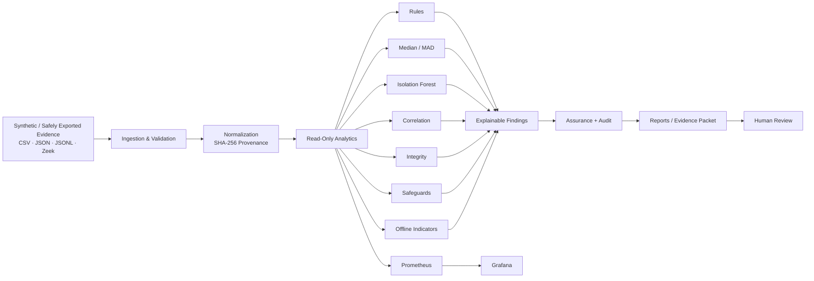
```mermaid
flowchart LR
    A["Synthetic / Safely Exported Evidence<br/>CSV · JSON · JSONL · Zeek"] --> B["Ingestion & Validation"]

    B --> C["Normalization<br/>SHA-256 Provenance"]

    C --> D["Read-Only Analytics"]

    D --> E["Rules"]
    D --> F["Median / MAD"]
    D --> G["Isolation Forest"]
    D --> H["Correlation"]
    D --> I["Integrity"]
    D --> J["Safeguards"]
    D --> K["Offline Indicators"]

    E --> L["Explainable Findings"]
    F --> L
    G --> L
    H --> L
    I --> L
    J --> L
    K --> L

    L --> M["Assurance + Audit"]
    M --> N["Reports / Evidence Packet"]
    N --> O["Human Review"]

    D --> P["Prometheus"]
    P --> Q["Grafana"]
```

The architecture deliberately maintains a separation between **evidence analytics** and **operational authority**.

> [!IMPORTANT]
> **Read-Only Analytics Boundary**
>
> Detection, scoring, correlation, assurance checks and reporting remain inside NuclearShield. Operational authority and plant-control decisions remain outside the platform.

---

# Evidence-to-Decision Workflow


```mermaid
flowchart LR
    A["Upload Evidence"] --> B["Validate"]
    B --> C["Normalize"]
    C --> D["Record SHA-256"]
    D --> E["Analyze"]
    E --> F["Correlate & Score"]
    F --> G["Review Findings"]
    G --> H["Assurance + Audit"]
    H --> I["Evidence Packet / Report"]
    I --> J["Human Decision"]

    J -. "No automated plant action" .-> K["Approved Procedure<br/>Outside NuclearShield"]
```

Every stage preserves the principle that a cybersecurity finding is **evidence for review**, not authorization for a plant action.

> [!TIP]
> **How to Read This Workflow**
>
> A high score or correlated finding means **review this evidence first**. It does not mean NuclearShield has confirmed an attack or authorized a response.

---

# Core Capabilities

| Area | NuclearShield v1.0.0 |
|---|---|
| Evidence Ingestion | CSV, JSON, JSONL/NDJSON and Zeek ASCII log evidence |
| Evidence Provenance | SHA-256 digest recorded for uploaded evidence |
| OT / SCADA Security | Explainable network and industrial-control evidence review |
| Deterministic Detection | Baseline, authorization and integrity checks |
| Statistical Detection | Median/MAD peer-group anomaly analysis |
| Machine Learning | scikit-learn Isolation Forest |
| Correlation | Cyber, access, asset and related evidence correlation |
| Safety Integrity | Approved-state and integrity evidence review |
| Safeguards | Offline PACS-like and MC&A-like evidence analysis |
| Threat Intelligence | Offline user-supplied indicator review |
| Assurance | Finite gateway and change-review policy checks |
| Audit | Analysis-linked audit history |
| Compliance Evidence | Framework mapping and evidence packet generation |
| Reports | Explainable findings and evidence-focused reporting |
| Monitoring | Prometheus metrics and Grafana visualization |
| Deployment | Docker Compose and Windows launcher |
| Safety Boundary | No autonomous containment or plant control |

---

# Detection and Analytics

NuclearShield combines several explainable detection methods instead of treating a single algorithm as authoritative.

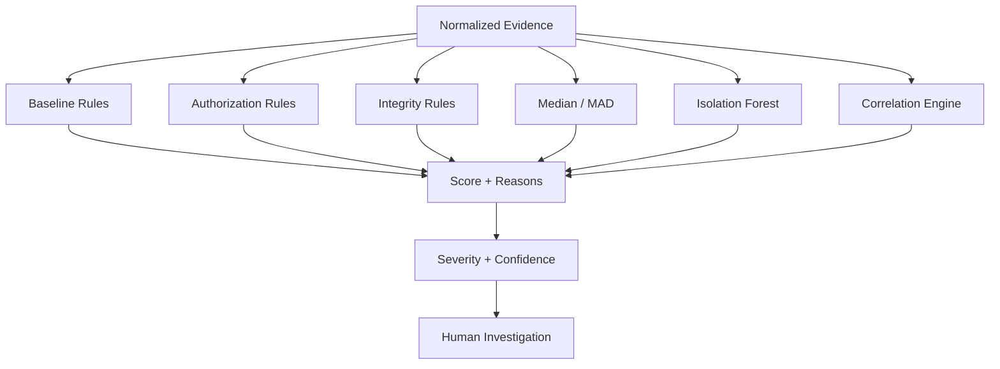
```mermaid
flowchart TB
    A["Normalized Evidence"] --> B["Baseline Rules"]
    A --> C["Authorization Rules"]
    A --> D["Integrity Rules"]
    A --> E["Median / MAD"]
    A --> F["Isolation Forest"]
    A --> G["Correlation Engine"]

    B --> H["Score + Reasons"]
    C --> H
    D --> H
    E --> H
    F --> H
    G --> H

    H --> I["Severity + Confidence"]
    I --> J["Human Investigation"]
```

## Deterministic Rules

The analysis engine checks evidence for conditions including:

- deviations from declared baselines
- unauthorized records
- integrity/signature mismatches
- categorical approved-state differences

The reason for each finding is retained so results remain explainable.

## Statistical Anomaly Detection

For suitable numeric evidence, NuclearShield uses median and Median Absolute Deviation (MAD) to identify unusual peer-group behaviour.

This provides a robust statistical signal without claiming that an unusual value is automatically malicious.

---

## Isolation Forest

NuclearShield includes a real `scikit-learn` Isolation Forest implementation for eligible network evidence.

The model:

- operates on the current uploaded evidence
- requires at least 20 suitable network rows
- uses numeric fields genuinely present in the evidence
- does not fabricate missing telemetry
- reports decision scores
- marks negative scores as outliers for review

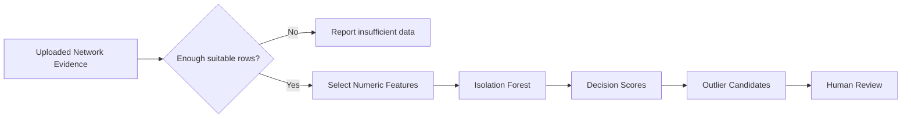
```mermaid
flowchart LR
    A["Uploaded Network Evidence"] --> B{"Enough suitable rows?"}

    B -->|"No"| C["Report insufficient data"]
    B -->|"Yes"| D["Select Numeric Features"]

    D --> E["Isolation Forest"]
    E --> F["Decision Scores"]
    F --> G["Outlier Candidates"]
    G --> H["Human Review"]
```

> [!IMPORTANT]
> **Machine Learning Scope**
>
> Isolation Forest is fitted only to eligible numeric network observations from the **current uploaded evidence**. It is an exploratory anomaly-screening mechanism, not a reactor-trained model, attack classifier, or validated nuclear-facility baseline.

> [!WARNING]
> **Outlier ≠ Attack**
>
> A negative Isolation Forest decision score identifies an observation as unusual relative to the current dataset. It does **not** establish malicious activity, compromise, or operational impact.

---

# Correlation Engine

NuclearShield can correlate evidence through shared actors and assets.

For example, a network, material, radiation or change record can be linked to relevant unauthorized access evidence where the records share an actor or asset.

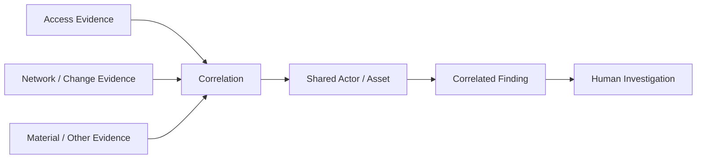
```mermaid
flowchart LR
    A["Access Evidence"] --> D["Correlation"]
    B["Network / Change Evidence"] --> D
    C["Material / Other Evidence"] --> D

    D --> E["Shared Actor / Asset"]
    E --> F["Correlated Finding"]
    F --> G["Human Investigation"]
```

> [!NOTE]
> **Correlation Adds Context, Not Intent**
>
> Shared actors, assets or related evidence can strengthen an investigation lead, but NuclearShield does not infer human intent or automatically label a person as an insider threat.

---

# OT / SCADA Security

The OT/SCADA workspace is designed around **passive evidence analysis**.

NuclearShield can review safely exported network and industrial-security records without establishing a command channel to industrial equipment.

Supported evidence can include information resembling:

- network connections
- source and destination addresses
- protocol-related fields
- Zeek exports
- Suricata-style evidence
- authorization states
- integrity states
- asset references

The project contains no operational plant topology or live controller connection.

> [!IMPORTANT]
> **Passive Evidence Analysis**
>
> Zeek and Suricata-related functionality operates on uploaded or exported security evidence. NuclearShield is not positioned as an inline IDS/IPS and does not require a direct connection to an industrial network.

---

# Safety-System Integrity

Safety-related integrity analysis focuses on evidence such as:

- approved values
- observed values
- integrity status
- signature status
- authorization
- asset identity
- repeated snapshots

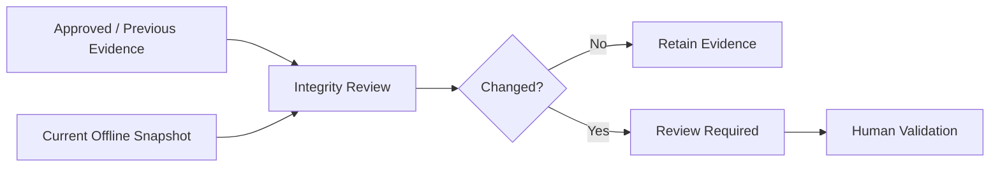
```mermaid
flowchart LR
    A["Approved / Previous Evidence"] --> C["Integrity Review"]
    B["Current Offline Snapshot"] --> C

    C --> D{"Changed?"}

    D -->|"No"| E["Retain Evidence"]
    D -->|"Yes"| F["Review Required"]

    F --> G["Human Validation"]
```

> [!WARNING]
> **Integrity Evidence Is Not Formal Verification**
>
> Detecting a changed hash, signature state, authorization state or snapshot difference does not prove whether safety software is correct or safe. Formal verification, engineering validation and licensed safety review remain outside NuclearShield.

---

# Assurance + Audit

Assurance and Audit operate as a connected workflow rather than isolated platform functions.

The Assurance Lab provides bounded software demonstrations for:

- one-way gateway policy
- change-review policy
- PACS/MC&A-style offline safeguards analysis
- repeated integrity snapshot comparison
- offline indicator review
- evidence-linked audit context

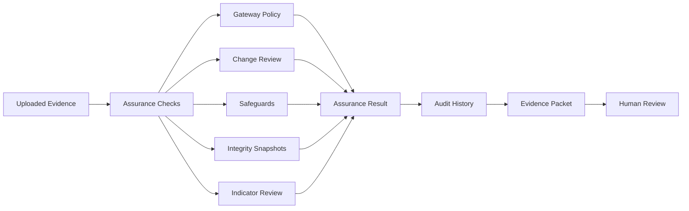
```mermaid
flowchart LR
    A["Uploaded Evidence"] --> B["Assurance Checks"]

    B --> C["Gateway Policy"]
    B --> D["Change Review"]
    B --> E["Safeguards"]
    B --> F["Integrity Snapshots"]
    B --> G["Indicator Review"]

    C --> H["Assurance Result"]
    D --> H
    E --> H
    F --> H
    G --> H

    H --> I["Audit History"]
    I --> J["Evidence Packet"]
    J --> K["Human Review"]
```

> [!NOTE]
> **Assurance and Audit Work Together**
>
> Assurance asks whether bounded evidence and policy conditions satisfy the demonstrated checks. Audit preserves the associated analysis history and references so the result can be reviewed later.

---

# One-Way Gateway Policy Model

NuclearShield contains a **finite software policy model** representing a one-way evidence boundary.

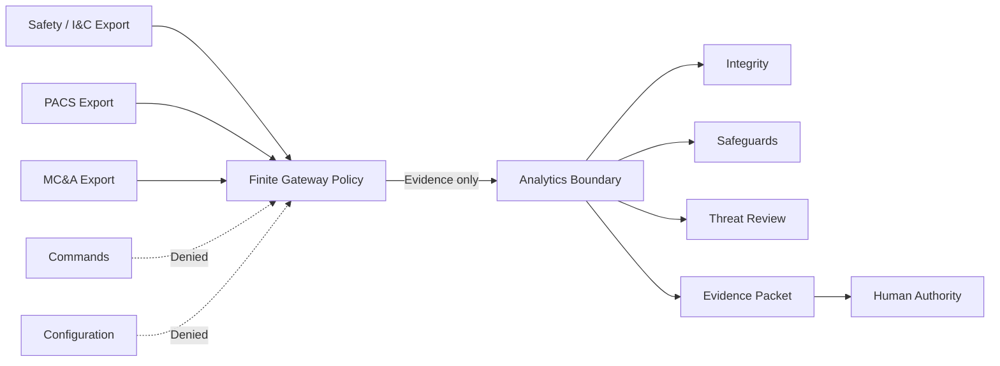
```mermaid
flowchart LR
    S["Safety / I&C Export"] --> G["Finite Gateway Policy"]
    P["PACS Export"] --> G
    M["MC&A Export"] --> G

    G -->|"Evidence only"| A["Analytics Boundary"]

    C["Commands"] -. "Denied" .-> G
    X["Configuration"] -. "Denied" .-> G

    A --> I["Integrity"]
    A --> SG["Safeguards"]
    A --> T["Threat Review"]
    A --> E["Evidence Packet"]

    E --> H["Human Authority"]
```

The model exhaustively checks a bounded set of source, destination and message-type states.

Only defined evidence paths into analytics are permitted.

Command and configuration paths are rejected by the software policy.

> [!CAUTION]
> **Software Policy Model — Not a Physical Data Diode**
>
> NuclearShield demonstrates the **policy logic** of one-way evidence movement. It does not claim hardware-enforced unidirectional communication, physical isolation, or deployment of a certified data-diode device.

> [!TIP]
> In an operational architecture, a physical one-way gateway would exist **outside NuclearShield**. NuclearShield represents the analytics destination receiving approved exported evidence.

---

# Nuclear Material Safeguards

NuclearShield contains an offline safeguards-oriented demonstration using:

- PACS-like access evidence
- MC&A-like material evidence
- shared actor/asset relationships
- declared inventory differences

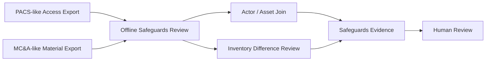
```mermaid
flowchart LR
    A["PACS-like Access Export"] --> C["Offline Safeguards Review"]
    B["MC&A-like Material Export"] --> C

    C --> D["Actor / Asset Join"]
    C --> E["Inventory Difference Review"]

    D --> F["Safeguards Evidence"]
    E --> F

    F --> G["Human Review"]
```

> [!CAUTION]
> **Synthetic / Offline Safeguards Evidence**
>
> PACS-like and MC&A-like records used by NuclearShield are demonstration evidence. The platform does not connect to real physical-access or nuclear material-accounting systems and contains no real nuclear material information.

> [!NOTE]
> Inventory differences are surfaced as **review prompts**. NuclearShield does not independently conclude that nuclear material has been lost, stolen, diverted or misaccounted for.

---

# Offline Threat-Indicator Review

NuclearShield supports an offline JSON indicator catalog.

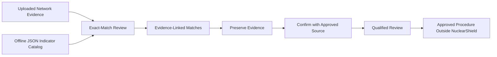
```mermaid
flowchart LR
    A["Uploaded Network Evidence"] --> C["Exact-Match Review"]
    B["Offline JSON Indicator Catalog"] --> C

    C --> D["Evidence-Linked Matches"]

    D --> E["Preserve Evidence"]
    E --> F["Confirm with Approved Source"]
    F --> G["Qualified Review"]
    G --> H["Approved Procedure Outside NuclearShield"]
```

Matching can use evidence fields such as source IP, destination IP and signature-related values.

The included catalog is not represented as an authenticated or live nuclear-sector threat-intelligence feed.

> [!WARNING]
> **Indicator Match ≠ Confirmed Compromise**
>
> Offline indicator matches identify evidence requiring investigation. The supplied catalog is not represented as an authenticated live nuclear-sector intelligence feed, and a match alone does not establish compromise.

---

# Human Authorization Boundary

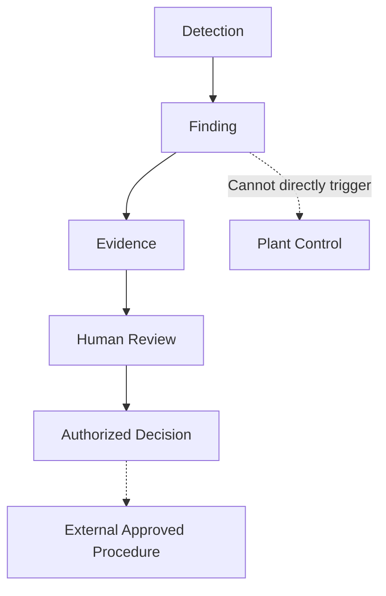
```mermaid
flowchart TB
    A["Detection"] --> B["Finding"]
    B --> C["Evidence"]
    C --> D["Human Review"]

    D --> E["Authorized Decision"]
    E -.-> F["External Approved Procedure"]

    B -. "Cannot directly trigger" .-> G["Plant Control"]
```

> [!IMPORTANT]
> **Human Authority Is the Final Boundary**
>
> NuclearShield may detect, prioritize, correlate, explain and preserve evidence. Decisions involving containment, configuration changes, safety actions, physical-security actions or plant operations require separately authorized human procedures.

NuclearShield can:

- detect
- score
- correlate
- explain
- preserve evidence
- generate reports

It cannot independently authorize:

- containment
- controller changes
- configuration changes
- safety actions
- physical-security actions
- plant commands

---

# Compliance Evidence

NuclearShield provides evidence-oriented mappings associated with themes from:

- IEC 62645
- NRC Regulatory Guide 5.71
- IAEA cybersecurity and safeguards guidance

The compliance workspace demonstrates how technical evidence can be organized around security requirements.

> [!CAUTION]
> **No Compliance or Certification Claim**
>
> References to IEC 62645, NRC Regulatory Guide 5.71 and IAEA guidance are evidence-oriented educational mappings. NuclearShield does not certify compliance, replace a regulatory assessment, or generate an officially accepted regulatory submission.

---

# Evidence Packet

A per-analysis evidence packet can contain information such as:

- analysis identifier
- evidence references
- SHA-256 provenance
- accepted/rejected record counts
- findings
- safeguards-review information
- audit references
- stated limitations
- packet SHA-256

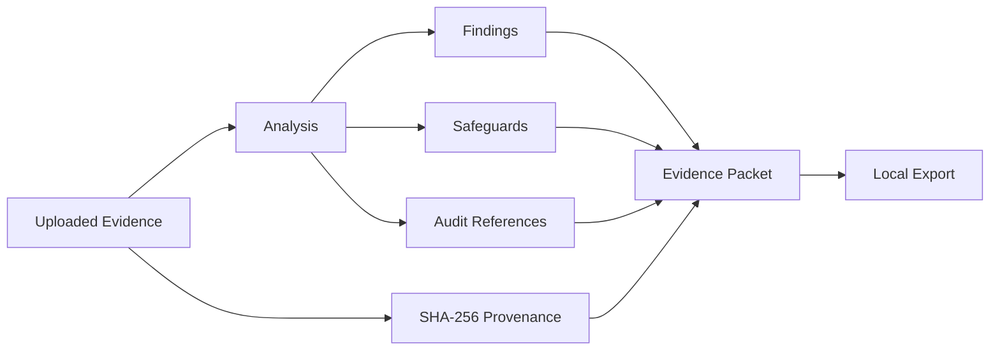
```mermaid
flowchart LR
    A["Uploaded Evidence"] --> B["Analysis"]
    B --> C["Findings"]
    B --> D["Safeguards"]
    B --> E["Audit References"]

    A --> F["SHA-256 Provenance"]

    C --> G["Evidence Packet"]
    D --> G
    E --> G
    F --> G

    G --> H["Local Export"]
```

> [!NOTE]
> **Evidence Packet ≠ Regulatory Submission**
>
> The exported packet provides locally traceable analysis context, provenance and audit references. It is designed for demonstration and evidence review, not regulator submission or immutable records retention.

---

# Monitoring

NuclearShield includes application observability using **Prometheus** and **Grafana**.

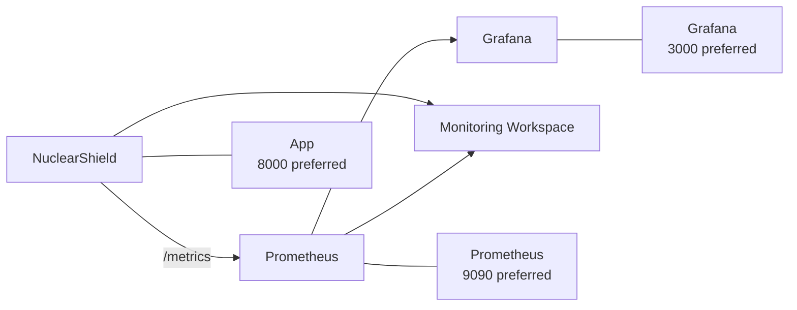
```mermaid
flowchart LR
    A["NuclearShield"] -->|"/metrics"| B["Prometheus"]
    B --> C["Grafana"]

    A --> D["Monitoring Workspace"]
    B --> D

    A --- E["App<br/>8000 preferred"]
    B --- F["Prometheus<br/>9090 preferred"]
    C --- G["Grafana<br/>3000 preferred"]
```

> [!IMPORTANT]
> **What Prometheus and Grafana Monitor**
>
> Prometheus and Grafana observe the **NuclearShield application stack** and its exposed software metrics. They do not monitor reactor instrumentation, PLCs, safety channels or live plant telemetry.

---

# Automatic Port Handling

The Windows launcher checks the preferred ports:

| Service | Preferred Port |
|---|---:|
| NuclearShield | 8000 |
| Prometheus | 9090 |
| Grafana | 3000 |

If a preferred port is unavailable, NuclearShield searches for another free port instead of terminating the unrelated process using it.

Selected runtime ports are written to:

```text
.runtime-ports.env
```

> [!TIP]
> **Port Already Occupied?**
>
> You normally do not need to terminate the existing process. The NuclearShield launcher searches for available alternatives for the application, Prometheus and Grafana and prints the selected URLs.

---

# Technology Stack

| Layer | Technology |
|---|---|
| Backend | Python 3.11+ |
| API / Web Server | FastAPI + Uvicorn |
| Machine Learning | scikit-learn |
| Frontend | HTML, CSS, JavaScript |
| Metrics | Prometheus Client |
| Monitoring | Prometheus |
| Visualization | Grafana |
| Deployment | Docker / Docker Compose |
| Testing | pytest |
| Linting | Ruff |
| Security Analysis | Bandit |
| Windows Launch | PowerShell + CMD |

---

# Repository Structure

```text
NuclearShield/
│
├── app/
│   ├── analyzer.py
│   ├── assurance.py
│   ├── compliance_packet.py
│   ├── intelligence.py
│   ├── main.py
│   ├── store.py
│   │
│   └── static/
│       ├── assets/
│       │   ├── nuclearshield-logo.svg
│       │   └── floating-plant.png
│       ├── sample-data/
│       ├── app.js
│       ├── index.html
│       └── styles.css
│
├── docs/
│   └── diagrams/
│
├── monitoring/
│   ├── prometheus.yml
│   └── grafana/
│
├── sample-data/
│
├── scripts/
│   └── pre-exam-check.ps1
│
├── tests/
│
├── docker-compose.yml
├── Dockerfile
├── START-NUCLEARSHIELD.cmd
├── start-nuclearshield.ps1
├── pyproject.toml
├── SECURITY.md
├── CHANGELOG.md
└── README.md
```

---

# Installation

## Requirements

For the standard Windows demonstration:

- Windows 10/11
- Docker Desktop
- Docker Compose v2
- modern web browser

> [!TIP]
> **Recommended for the First Run**
>
> Start Docker Desktop before launching NuclearShield. The first startup may take longer because required container images may need to be downloaded and the application image built.

---

# Windows One-Click Start

> [!WARNING]
> **Extract the ZIP First**
>
> Do not double-click `START-NUCLEARSHIELD.cmd` while browsing the compressed archive. Windows may temporarily extract only the launcher instead of the complete project, causing the PowerShell script or other project files to appear missing.

Clone or download NuclearShield and extract the complete project.

Then double-click:

```text
START-NUCLEARSHIELD.cmd
```

The launcher:

1. checks Docker
2. starts Docker Desktop when available and required
3. waits for the Docker engine
4. validates Docker Compose
5. checks runtime ports
6. automatically selects alternatives when necessary
7. prepares required monitoring images
8. builds or reuses the NuclearShield image
9. starts NuclearShield, Prometheus and Grafana
10. displays the selected local URLs

---

# Docker Compose

From the project directory:

```powershell
docker compose up --build -d
```

Check the services:

```powershell
docker compose ps
```

Stop NuclearShield:

```powershell
docker compose down
```

The application container is hardened with controls including:

- read-only filesystem
- dropped Linux capabilities
- `no-new-privileges`
- temporary writable `/tmp`

> [!NOTE]
> Container hardening reduces the attack surface of the demonstration environment. It does not convert NuclearShield into a safety-qualified or production nuclear platform.

---

# Demonstration Data

> [!TIP]
> **Recommended Demonstration Order**
>
> Start with `NuclearShield-Full-Platform-100-Records.jsonl` for the complete platform, upload `08-later-integrity-snapshot.csv` when demonstrating snapshot comparison, and use `NuclearShield-IsolationForest-80-Network-Records.csv` for the focused ML demonstration.

## Complete Platform Dataset

```text
sample-data/NuclearShield-Full-Platform-100-Records.jsonl
```

Use this for the broad platform walkthrough.

## Isolation Forest Dataset

```text
sample-data/NuclearShield-IsolationForest-80-Network-Records.csv
```

Use this to demonstrate the machine-learning workflow.

## Integrity Snapshot

```text
sample-data/08-later-integrity-snapshot.csv
```

Upload this after the full-platform evidence to demonstrate repeated offline snapshot comparison.

The repository also includes an offline synthetic threat-indicator catalog.

> [!NOTE]
> All bundled demonstration evidence is fictional and synthetic. Do not replace it with sensitive operational nuclear information.

---

# Pre-Exam Validation

With the platform running:

```powershell
powershell -ExecutionPolicy Bypass -File .\scripts\pre-exam-check.ps1
```

The script checks:

- required demonstration datasets
- Docker Compose configuration
- NuclearShield application health
- Prometheus readiness
- Grafana health
- Prometheus targets API

> [!TIP]
> Run the pre-exam check on the same machine you will use for the demonstration. It helps catch Docker, dataset and monitoring-service issues before presentation time.

---

# Automated Tests

Run:

```powershell
python -m pytest -q
```

The automated tests cover core analysis, APIs, Assurance Lab, evidence packets, indicator review and platform behavior.

> [!NOTE]
> Automated tests validate the software implementation and expected demonstration behavior. Passing tests do not constitute validation or certification for deployment in a nuclear facility.

---

# Security & Responsible Use

NuclearShield deliberately contains no:

- real nuclear plant topology
- operational credentials
- exploit logic
- control commands
- reactor process set points
- personnel records
- real nuclear material information

The bundled demonstration evidence is fictional and synthetic.

Do **not** connect NuclearShield to:

- operational nuclear facilities
- production SCADA networks
- I&C networks
- safety systems
- physical-access systems
- real MC&A systems
- production industrial environments

See [SECURITY.md](SECURITY.md).

> [!WARNING]
> **Do Not Upload Sensitive Facility Data**
>
> NuclearShield is designed for synthetic or appropriately exported demonstration evidence. Real nuclear-security-sensitive, safeguards-sensitive, personnel, credential, topology or operational information should not be placed in the public repository or demonstration environment.

---

# Important Limitations

> [!CAUTION]
> **Scope Matters**
>
> NuclearShield demonstrates how a defensive evidence-analysis architecture can be implemented in software. Features representing nuclear cybersecurity concepts must not be interpreted as claims of production nuclear deployment, regulatory approval, safety qualification, or operational authority.

NuclearShield v1.0.0 does **not** claim:

- physical air-gap enforcement
- a physical data diode
- live SCADA integration
- live I&C integration
- live PACS integration
- live MC&A integration
- continuous safety-controller monitoring
- formal verification of licensed safety code
- autonomous incident containment
- plant-control authority
- authenticated live nuclear threat intelligence
- regulatory certification
- immutable external regulatory audit storage

Isolation Forest is exploratory per-upload anomaly screening and is not a validated nuclear-facility ML model.

Prometheus and Grafana observe the NuclearShield demonstration stack, not operational nuclear telemetry.

---

# Documentation

| Document | Purpose |
|---|---|
| [20-Minute Demonstration Guide](docs/DEMO.md) | Recommended oral-exam platform walkthrough |
| [Topic 132 Requirements Map](docs/REQUIREMENTS-MAP.md) | Maps exam requirements to implemented features and limitations |
| [Assurance Lab](docs/ASSURANCE-LAB.md) | Explains bounded Assurance functionality |
| [Evidence Packet](docs/EVIDENCE-PACKET.md) | Documents evidence-packet generation and scope |
| [Security Policy](SECURITY.md) | Defines safe-use and security boundaries |
| [Contributing](CONTRIBUTING.md) | Repository contribution guidance |
| [Changelog](CHANGELOG.md) | NuclearShield release history |

---

# Design Principles

NuclearShield v1.0.0 follows five central principles:

### Defensive

The platform analyzes evidence rather than enabling offensive activity.

### Read-Only

The analytical architecture does not provide a plant-control path.

### Evidence-Driven

Results originate from uploaded evidence and preserve provenance.

### Explainable

Findings retain reasons, contributors, scores and related evidence instead of exposing only an unexplained alert.

### Human-Authorized

The platform supports human decisions rather than replacing authorized engineering, security, safeguards or operational authority.

> [!IMPORTANT]
> **The central design rule of NuclearShield is simple:**
>
> **Analyze evidence deeply, explain findings clearly, preserve traceability, and leave operational authority with authorized humans.**

---

# License

NuclearShield is released under the [MIT License](LICENSE).

---

<p align="center">
  
</p>

<p align="center">
  <strong>NuclearShield v1.0.0</strong>
</p>

<p align="center">
  Defensive · Read-Only · Evidence-Driven · Explainable · Observable
</p>

<p align="center">
  Nuclear Cybersecurity Evidence · Assurance · Audit · Monitoring
</p>
