<p align="center">
  
</p>

<h1 align="center">NuclearShield v1.0.0</h1>

<h3 align="center">Defensive Nuclear Cybersecurity Evidence & Assurance Platform</h3>

<p align="center">
  <strong>Defensive · Read-Only · Evidence-Driven · Explainable · Observable</strong>
</p>

---

> **Safety Boundary**
>
> NuclearShield is an educational, defensive workstation for synthetic or safely exported offline evidence. It does not connect to or control nuclear facilities, SCADA/I&C equipment, safety systems, PACS, MC&A systems, or production industrial networks.
>
> It does not implement a physical data diode, verify licensed safety code, establish regulatory compliance, or authorize plant actions. Human authority remains the final decision boundary.

## Overview

**NuclearShield v1.0.0** is a defensive, read-only nuclear cybersecurity evidence and assurance platform.

It combines evidence ingestion, explainable cybersecurity analysis, OT/SCADA review, safety-integrity evidence analysis, safeguards-oriented review, machine-learning-assisted anomaly screening, offline threat-indicator review, Assurance and Audit, compliance evidence mapping, reporting, and observability in one platform.

The platform accepts:

- CSV
- JSON
- JSONL / NDJSON
- Zeek `.log` evidence

Uploaded evidence is validated and normalized, its SHA-256 provenance is recorded, and the resulting records can be processed by deterministic rules, statistical analysis, Isolation Forest screening, correlation logic, safeguards checks, integrity analysis, and offline threat-indicator review.

NuclearShield provides **decision support only**. It does not perform autonomous containment or send commands to operational technology.

---

# Platform Architecture

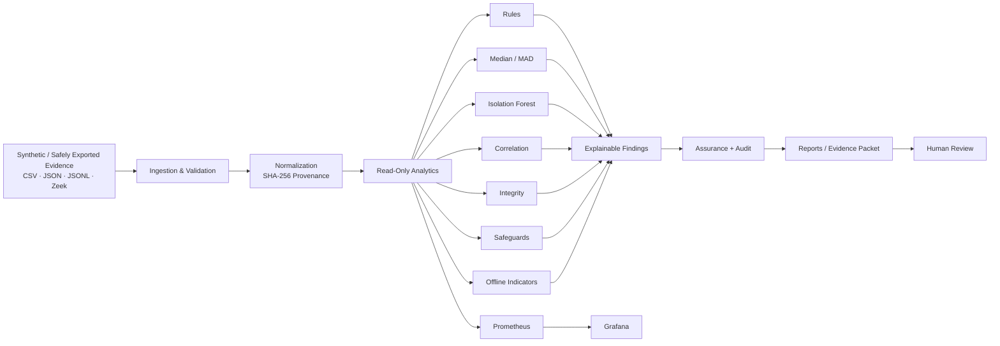
```mermaid
flowchart LR
    A["Synthetic / Safely Exported Evidence<br/>CSV · JSON · JSONL · Zeek"] --> B["Ingestion & Validation"]

    B --> C["Normalization<br/>SHA-256 Provenance"]

    C --> D["Read-Only Analytics"]

    D --> E["Rules"]
    D --> F["Median / MAD"]
    D --> G["Isolation Forest"]
    D --> H["Correlation"]
    D --> I["Integrity"]
    D --> J["Safeguards"]
    D --> K["Offline Indicators"]

    E --> L["Explainable Findings"]
    F --> L
    G --> L
    H --> L
    I --> L
    J --> L
    K --> L

    L --> M["Assurance + Audit"]
    M --> N["Reports / Evidence Packet"]
    N --> O["Human Review"]

    D --> P["Prometheus"]
    P --> Q["Grafana"]
```

The architecture deliberately maintains a separation between **evidence analytics** and **operational authority**.

---

# Evidence-to-Decision Workflow


```mermaid
flowchart LR
    A["Upload Evidence"] --> B["Validate"]
    B --> C["Normalize"]
    C --> D["Record SHA-256"]
    D --> E["Analyze"]
    E --> F["Correlate & Score"]
    F --> G["Review Findings"]
    G --> H["Assurance + Audit"]
    H --> I["Evidence Packet / Report"]
    I --> J["Human Decision"]

    J -. "No automated plant action" .-> K["Approved Procedure<br/>Outside NuclearShield"]
```

Every stage preserves the principle that a cybersecurity finding is **evidence for review**, not authorization for a plant action.

---

# Core Capabilities

| Area | NuclearShield v1.0.0 |
|---|---|
| Evidence Ingestion | CSV, JSON, JSONL/NDJSON and Zeek ASCII log evidence |
| Evidence Provenance | SHA-256 digest recorded for uploaded evidence |
| OT / SCADA Security | Explainable network and industrial-control evidence review |
| Deterministic Detection | Baseline, authorization and integrity checks |
| Statistical Detection | Median/MAD peer-group anomaly analysis |
| Machine Learning | scikit-learn Isolation Forest |
| Correlation | Cyber, access, asset and related evidence correlation |
| Safety Integrity | Approved-state and integrity evidence review |
| Safeguards | Offline PACS-like and MC&A-like evidence analysis |
| Threat Intelligence | Offline user-supplied indicator review |
| Assurance | Finite gateway and change-review policy checks |
| Audit | Analysis-linked audit history |
| Compliance Evidence | Framework mapping and evidence packet generation |
| Reports | Explainable findings and evidence-focused reporting |
| Monitoring | Prometheus metrics and Grafana visualization |
| Deployment | Docker Compose and Windows launcher |
| Safety Boundary | No autonomous containment or plant control |

---

# Detection and Analytics

NuclearShield combines several explainable detection methods instead of treating a single algorithm as authoritative.

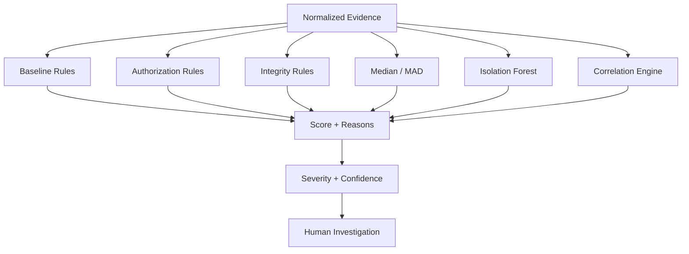
```mermaid
flowchart TB
    A["Normalized Evidence"] --> B["Baseline Rules"]
    A --> C["Authorization Rules"]
    A --> D["Integrity Rules"]
    A --> E["Median / MAD"]
    A --> F["Isolation Forest"]
    A --> G["Correlation Engine"]

    B --> H["Score + Reasons"]
    C --> H
    D --> H
    E --> H
    F --> H
    G --> H

    H --> I["Severity + Confidence"]
    I --> J["Human Investigation"]
```

## Deterministic Rules

The analysis engine checks evidence for conditions including:

- deviations from declared baselines
- unauthorized records
- integrity/signature mismatches
- categorical approved-state differences

The reason for each finding is retained so results remain explainable.

## Statistical Anomaly Detection

For suitable numeric evidence, NuclearShield uses median and Median Absolute Deviation (MAD) to identify unusual peer-group behaviour.

This provides a robust statistical signal without claiming that an unusual value is automatically malicious.

## Isolation Forest

NuclearShield includes a real `scikit-learn` Isolation Forest implementation for eligible network evidence.

The model:

- operates on the current uploaded evidence
- requires at least 20 suitable network rows
- uses numeric fields genuinely present in the evidence
- does not fabricate missing telemetry
- reports decision scores
- marks negative scores as outliers for review

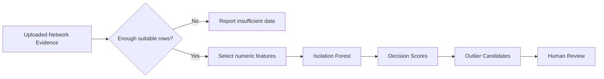
```mermaid
flowchart LR
    A["Uploaded Network Evidence"] --> B{"Enough suitable rows?"}

    B -->|"No"| C["Report insufficient data"]
    B -->|"Yes"| D["Select numeric features"]

    D --> E["Isolation Forest"]
    E --> F["Decision Scores"]
    F --> G["Outlier Candidates"]
    G --> H["Human Review"]
```

An Isolation Forest outlier is **not a confirmed cyberattack**.

The model is not trained on a nuclear facility baseline and does not authorize operational actions.

---

# Correlation Engine

NuclearShield can correlate evidence through shared actors and assets.

For example, a network, material, radiation or change record can be linked to relevant unauthorized access evidence where the records share an actor or asset.

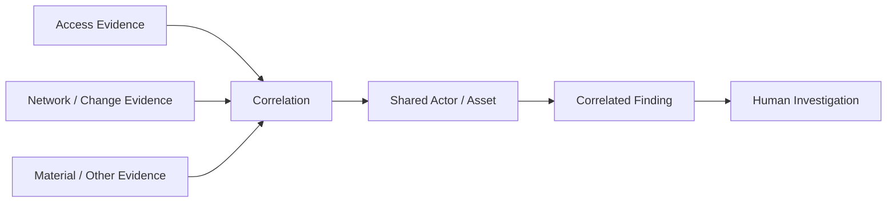
```mermaid
flowchart LR
    A["Access Evidence"] --> D["Correlation"]
    B["Network / Change Evidence"] --> D
    C["Material / Other Evidence"] --> D

    D --> E["Shared Actor / Asset"]
    E --> F["Correlated Finding"]
    F --> G["Human Investigation"]
```

Correlation provides additional context. It does not infer a person's intent or automatically classify insider activity.

---

# OT / SCADA Security

The OT/SCADA workspace is designed around **passive evidence analysis**.

NuclearShield can review safely exported network and industrial-security records without establishing a command channel to industrial equipment.

Supported evidence can include information resembling:

- network connections
- source and destination addresses
- protocol-related fields
- Zeek exports
- Suricata-style evidence
- authorization states
- integrity states
- asset references

The project contains no operational plant topology or live controller connection.

---

# Safety-System Integrity

Safety-related integrity analysis focuses on evidence such as:

- approved values
- observed values
- integrity status
- signature status
- authorization
- asset identity
- repeated snapshots

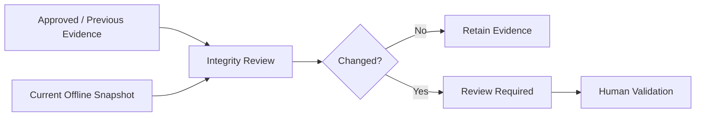
```mermaid
flowchart LR
    A["Approved / Previous Evidence"] --> C["Integrity Review"]
    B["Current Offline Snapshot"] --> C

    C --> D{"Changed?"}

    D -->|"No"| E["Retain Evidence"]
    D -->|"Yes"| F["Review Required"]

    F --> G["Human Validation"]
```

NuclearShield does **not** formally verify reactor protection code, safety firmware, PLC logic or licensed nuclear safety software.

---

# Assurance + Audit

Assurance and Audit are presented as a connected workflow rather than isolated platform functions.

The Assurance Lab provides bounded software demonstrations for:

- one-way gateway policy
- change-review policy
- PACS/MC&A-style offline safeguards analysis
- repeated integrity snapshot comparison
- offline indicator review
- evidence-linked audit context

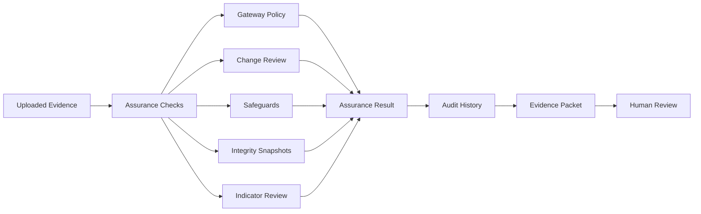
```mermaid
flowchart LR
    A["Uploaded Evidence"] --> B["Assurance Checks"]

    B --> C["Gateway Policy"]
    B --> D["Change Review"]
    B --> E["Safeguards"]
    B --> F["Integrity Snapshots"]
    B --> G["Indicator Review"]

    C --> H["Assurance Result"]
    D --> H
    E --> H
    F --> H
    G --> H

    H --> I["Audit History"]
    I --> J["Evidence Packet"]
    J --> K["Human Review"]
```

---

# One-Way Gateway Policy Model

NuclearShield contains a **finite software policy model** representing a one-way evidence boundary.

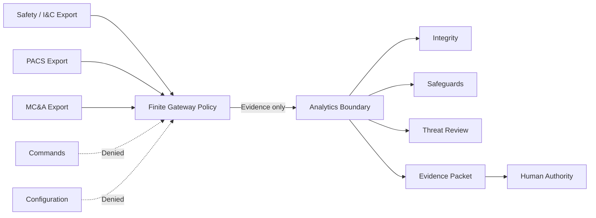
```mermaid
flowchart LR
    S["Safety / I&C Export"] --> G["Finite Gateway Policy"]
    P["PACS Export"] --> G
    M["MC&A Export"] --> G

    G -->|"Evidence only"| A["Analytics Boundary"]

    C["Commands"] -. "Denied" .-> G
    X["Configuration"] -. "Denied" .-> G

    A --> I["Integrity"]
    A --> SG["Safeguards"]
    A --> T["Threat Review"]
    A --> E["Evidence Packet"]

    E --> H["Human Authority"]
```

The model exhaustively checks a bounded set of source, destination and message-type states.

Only defined evidence paths into analytics are permitted.

Command and configuration paths are rejected by the software policy.

### Important

This is **not a physical data diode**.

It demonstrates the security policy associated with one-way evidence movement without claiming deployment of hardware-enforced one-way communication.

---

# Nuclear Material Safeguards

NuclearShield contains an offline safeguards-oriented demonstration using:

- PACS-like access evidence
- MC&A-like material evidence
- shared actor/asset relationships
- declared inventory differences

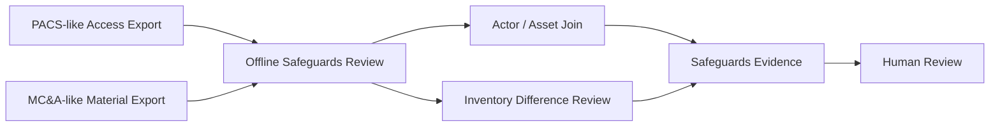
```mermaid
flowchart LR
    A["PACS-like Access Export"] --> C["Offline Safeguards Review"]
    B["MC&A-like Material Export"] --> C

    C --> D["Actor / Asset Join"]
    C --> E["Inventory Difference Review"]

    D --> F["Safeguards Evidence"]
    E --> F

    F --> G["Human Review"]
```

The application does not connect to a real Physical Access Control System or Material Control and Accounting system.

Inventory differences are review prompts, not conclusions about diversion or loss.

---

# Offline Threat-Indicator Review

NuclearShield supports an offline JSON indicator catalog.

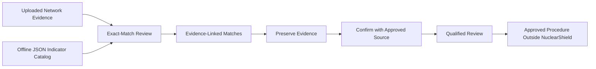
```mermaid
flowchart LR
    A["Uploaded Network Evidence"] --> C["Exact-Match Review"]
    B["Offline JSON Indicator Catalog"] --> C

    C --> D["Evidence-Linked Matches"]

    D --> E["Preserve Evidence"]
    E --> F["Confirm with Approved Source"]
    F --> G["Qualified Review"]
    G --> H["Approved Procedure Outside NuclearShield"]
```

Matching can use evidence fields such as source IP, destination IP and signature-related values.

The included catalog is not represented as an authenticated or live nuclear-sector threat-intelligence feed.

A match is a lead for investigation, not proof of compromise.

---

# Human Authorization Boundary

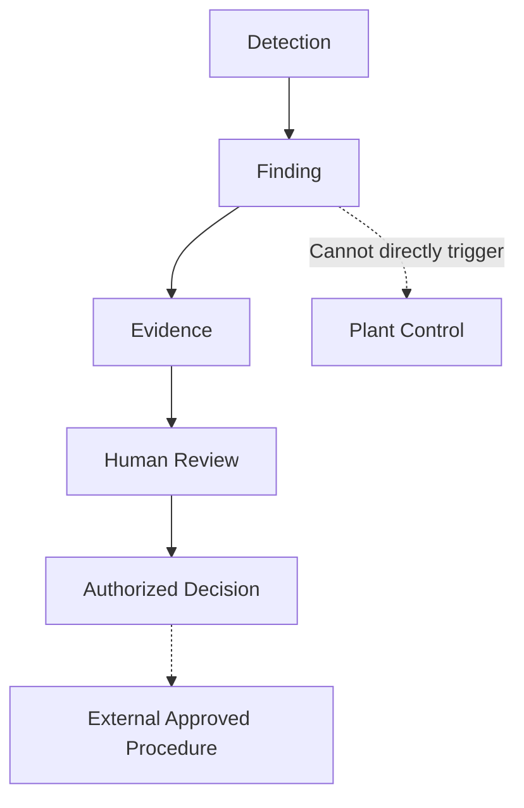
```mermaid
flowchart TB
    A["Detection"] --> B["Finding"]
    B --> C["Evidence"]
    C --> D["Human Review"]

    D --> E["Authorized Decision"]

    E -.-> F["External Approved Procedure"]

    B -. "Cannot directly trigger" .-> G["Plant Control"]
```

This boundary is fundamental to NuclearShield.

The application can:

- detect
- score
- correlate
- explain
- preserve evidence
- generate reports

It cannot independently authorize:

- containment
- controller changes
- configuration changes
- safety actions
- physical-security actions
- plant commands

---

# Compliance Evidence

NuclearShield provides evidence-oriented mappings associated with themes from:

- IEC 62645
- NRC Regulatory Guide 5.71
- IAEA cybersecurity and safeguards guidance

The compliance workspace is intended to demonstrate how technical evidence can be organized around security requirements.

It does **not** establish certification or regulatory compliance.

---

# Evidence Packet

A per-analysis evidence packet can contain information such as:

- analysis identifier
- evidence references
- SHA-256 provenance
- accepted/rejected record counts
- findings
- safeguards-review information
- audit references
- stated limitations
- packet SHA-256

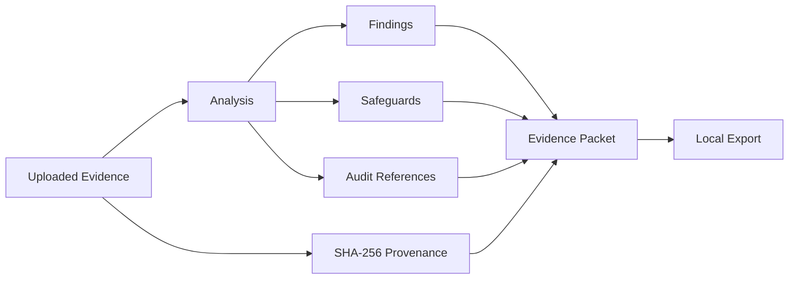
```mermaid
flowchart LR
    A["Uploaded Evidence"] --> B["Analysis"]
    B --> C["Findings"]
    B --> D["Safeguards"]
    B --> E["Audit References"]

    A --> F["SHA-256 Provenance"]

    C --> G["Evidence Packet"]
    D --> G
    E --> G
    F --> G

    G --> H["Local Export"]
```

The packet is a local training and evidence artifact, not an official regulator submission.

---

# Monitoring

NuclearShield includes application observability using **Prometheus** and **Grafana**.

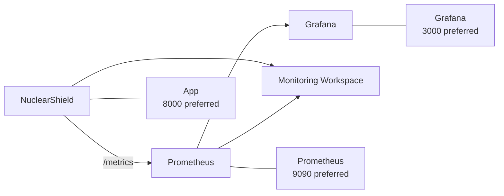
```mermaid
flowchart LR
    A["NuclearShield"] -->|"/metrics"| B["Prometheus"]
    B --> C["Grafana"]

    A --> D["Monitoring Workspace"]
    B --> D

    A --- E["App<br/>8000 preferred"]
    B --- F["Prometheus<br/>9090 preferred"]
    C --- G["Grafana<br/>3000 preferred"]
```

Prometheus collects metrics from the NuclearShield software.

Grafana visualizes those metrics.

Neither component is represented as monitoring a live nuclear reactor or operational safety system.

---

# Automatic Port Handling

The Windows launcher checks the preferred ports:

| Service | Preferred Port |
|---|---:|
| NuclearShield | 8000 |
| Prometheus | 9090 |
| Grafana | 3000 |

If a preferred port is unavailable, NuclearShield searches for another free port instead of terminating the unrelated process using it.

Selected runtime ports are written to:

```text
.runtime-ports.env
```

---

# Technology Stack

| Layer | Technology |
|---|---|
| Backend | Python |
| API / Web Server | FastAPI + Uvicorn |
| Machine Learning | scikit-learn |
| Frontend | HTML, CSS, JavaScript |
| Metrics | Prometheus Client |
| Monitoring | Prometheus |
| Visualization | Grafana |
| Deployment | Docker / Docker Compose |
| Testing | pytest |
| Linting | Ruff |
| Security Analysis | Bandit |
| Windows Launch | PowerShell + CMD |

---

# Repository Structure

```text
NuclearShield/
│
├── app/
│   ├── analyzer.py
│   ├── assurance.py
│   ├── compliance_packet.py
│   ├── intelligence.py
│   ├── main.py
│   ├── store.py
│   │
│   └── static/
│       ├── assets/
│       │   ├── nuclearshield-logo.svg
│       │   └── floating-plant.png
│       ├── sample-data/
│       ├── app.js
│       ├── index.html
│       └── styles.css
│
├── docs/
│   └── diagrams/
│
├── monitoring/
│   ├── prometheus.yml
│   └── grafana/
│
├── sample-data/
│
├── scripts/
│   └── pre-exam-check.ps1
│
├── tests/
│
├── docker-compose.yml
├── Dockerfile
├── START-NUCLEARSHIELD.cmd
├── start-nuclearshield.ps1
├── pyproject.toml
├── SECURITY.md
├── CHANGELOG.md
└── README.md
```

---

# Installation

## Requirements

For the standard Windows demonstration:

- Windows 10/11
- Docker Desktop
- Docker Compose v2
- Web browser

---

# Windows One-Click Start

Clone or download NuclearShield and **extract the complete project**.

Do not run the launcher while the project is still inside a compressed ZIP.

Then double-click:

```text
START-NUCLEARSHIELD.cmd
```

The launcher:

1. checks Docker
2. starts Docker Desktop when available and required
3. waits for the Docker engine
4. validates Docker Compose
5. checks runtime ports
6. automatically selects alternatives when necessary
7. prepares required monitoring images
8. builds/reuses the NuclearShield image
9. starts NuclearShield, Prometheus and Grafana
10. displays the selected local URLs

---

# Docker Compose

From the project directory:

```powershell
docker compose up --build -d
```

Check the services:

```powershell
docker compose ps
```

Stop NuclearShield:

```powershell
docker compose down
```

The application container is hardened with controls including:

- read-only filesystem
- dropped Linux capabilities
- `no-new-privileges`
- temporary writable `/tmp`

---

# Demonstration Data

## Complete Platform Dataset

```text
sample-data/NuclearShield-Full-Platform-100-Records.jsonl
```

Use this for the broad platform walkthrough.

## Isolation Forest Dataset

```text
sample-data/NuclearShield-IsolationForest-80-Network-Records.csv
```

Use this to demonstrate the machine-learning workflow.

## Integrity Snapshot

```text
sample-data/08-later-integrity-snapshot.csv
```

Upload this after the full-platform evidence to demonstrate repeated offline snapshot comparison.

The repository also includes an offline synthetic threat-indicator catalog.

---

# Pre-Exam Validation

With the platform running:

```powershell
powershell -ExecutionPolicy Bypass -File .\scripts\pre-exam-check.ps1
```

The script checks:

- required demonstration datasets
- Docker Compose configuration
- NuclearShield application health
- Prometheus readiness
- Grafana health
- Prometheus targets API

---

# Automated Tests

Run:

```powershell
python -m pytest -q
```

The automated tests cover core analysis, APIs, Assurance Lab, evidence packets, indicator review and platform behavior.

---

# Security & Responsible Use

NuclearShield deliberately contains no:

- real nuclear plant topology
- operational credentials
- exploit logic
- control commands
- reactor process set points
- personnel records
- real nuclear material information

The bundled demonstration evidence is fictional and synthetic.

Do **not** connect NuclearShield to:

- operational nuclear facilities
- production SCADA networks
- I&C networks
- safety systems
- physical-access systems
- real MC&A systems
- production industrial environments

See [SECURITY.md](SECURITY.md).

---

# Important Limitations

NuclearShield v1.0.0 does **not** claim:

- physical air-gap enforcement
- a physical data diode
- live SCADA integration
- live I&C integration
- live PACS integration
- live MC&A integration
- continuous safety-controller monitoring
- formal verification of licensed safety code
- autonomous incident containment
- plant-control authority
- authenticated live nuclear threat intelligence
- regulatory certification
- immutable external regulatory audit storage

Isolation Forest is exploratory per-upload anomaly screening and is not a validated nuclear-facility ML model.

Prometheus and Grafana observe the NuclearShield demonstration stack, not operational nuclear telemetry.

---

# Documentation

- [20-Minute Demonstration Guide](docs/DEMO.md)
- [Topic 132 Requirements Map](docs/REQUIREMENTS-MAP.md)
- [Assurance Lab](docs/ASSURANCE-LAB.md)
- [Evidence Packet](docs/EVIDENCE-PACKET.md)
- [Security Policy](SECURITY.md)
- [Contributing](CONTRIBUTING.md)
- [Changelog](CHANGELOG.md)

---

# License

NuclearShield is released under the [MIT License](LICENSE).

---

<p align="center">
  
</p>

<p align="center">
  <strong>NuclearShield v1.0.0</strong>
</p>

<p align="center">
  Defensive · Read-Only · Evidence-Driven · Explainable · Observable
</p>
